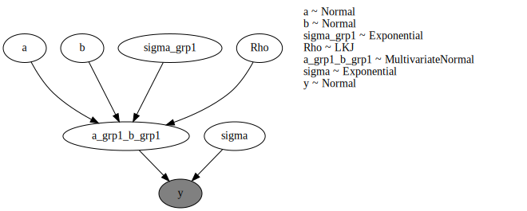
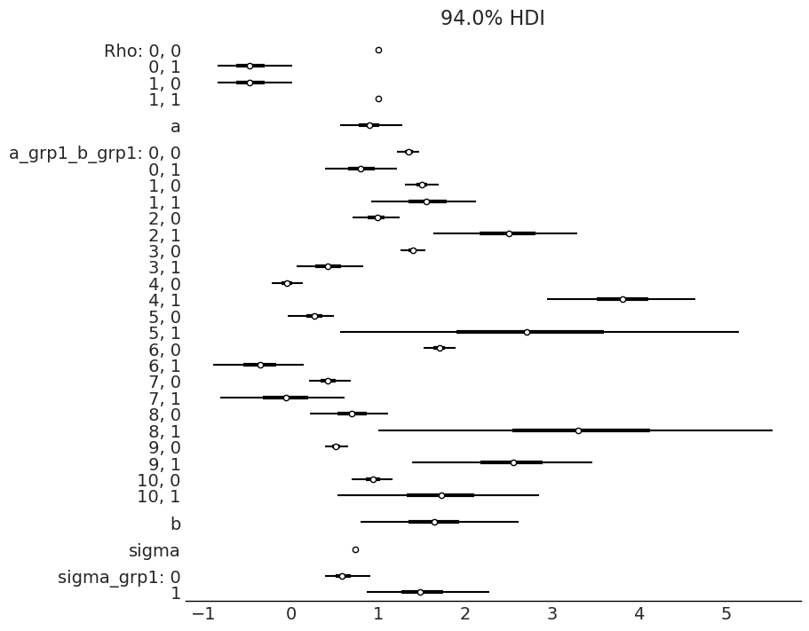

## Nympyro model library  
A library contaning numpyro models for future reference.  The model naming convention corresponds to models replicated in R using `brms` and `rethinking` and also in Python using `PyMC`.  

### Imports


```python
# from jax import grad, jit, vmap
# import jax
from jax import random
import jax.numpy as jnp
import datetime as dt

# import pyro
import numpyro
from numpyro.infer import MCMC, NUTS, Predictive
import numpyro.distributions as dist

import pandas as pd
import numpy as np
from sklearn.preprocessing import LabelEncoder

import matplotlib.pyplot as plt
import arviz as az
```

    /home/brent/anaconda3/envs/pytorch_pyro/lib/python3.9/site-packages/tqdm/auto.py:22: TqdmWarning: IProgress not found. Please update jupyter and ipywidgets. See https://ipywidgets.readthedocs.io/en/stable/user_install.html
      from .autonotebook import tqdm as notebook_tqdm


### Data  

`stock_data.csv` contains the same data as is stored in the similarly named Rdata file in my R package [romerb](https://github.com/Brent-Morrison/romerb)


```python
# Read data
df_raw = pd.read_csv('stock_data.csv')

# New df for analysis
df1 = df_raw
df1['date_stamp']= pd.to_datetime(df1['date_stamp'], format="%d/%m/%Y")
df1 = df1[df1['date_stamp'] == '2021-06-30'].copy()

# Scale function
scale = lambda x: (x - x.mean()) / x.std()

df1['log_mkt_cap'] = np.log(df1['mkt_cap'])
df1['log_assets'] = np.log(df1['total_assets'])
df1['log_equity_cln'] = np.log(-df1['total_equity_cln'])
df1['roe'] = -df1['roe']
df1['roe_s'] = df1.roe.pipe(scale)
df1['leverage_s'] = df1.leverage.pipe(scale)

le = LabelEncoder()
df1['sector_tf'] = le.fit_transform(df1['sector'].values)

cols = ['date_stamp', 'symbol', 'log_mkt_cap', 'log_assets', 'log_equity_cln', 'roe', 'roe_s', 'leverage', 'leverage_s', 'sector_tf', 'log_pb']
df1 = df1[cols].copy()

df1.head()
```


<div>
<style scoped>
    .dataframe tbody tr th:only-of-type {
        vertical-align: middle;
    }

    .dataframe tbody tr th {
        vertical-align: top;
    }

    .dataframe thead th {
        text-align: right;
    }
</style>
<table border="1" class="dataframe">
  <thead>
    <tr style="text-align: right;">
      <th></th>
      <th>date_stamp</th>
      <th>symbol</th>
      <th>log_mkt_cap</th>
      <th>log_assets</th>
      <th>log_equity_cln</th>
      <th>roe</th>
      <th>roe_s</th>
      <th>leverage</th>
      <th>leverage_s</th>
      <th>sector_tf</th>
      <th>log_pb</th>
    </tr>
  </thead>
  <tbody>
    <tr>
      <th>53</th>
      <td>2021-06-30</td>
      <td>A</td>
      <td>10.716239</td>
      <td>9.177197</td>
      <td>8.477204</td>
      <td>0.166845</td>
      <td>0.383000</td>
      <td>0.503411</td>
      <td>-0.688139</td>
      <td>6</td>
      <td>2.234926</td>
    </tr>
    <tr>
      <th>86</th>
      <td>2021-06-30</td>
      <td>AA</td>
      <td>8.833674</td>
      <td>9.606428</td>
      <td>8.520388</td>
      <td>-0.031416</td>
      <td>-0.353283</td>
      <td>0.662450</td>
      <td>0.167220</td>
      <td>10</td>
      <td>0.313342</td>
    </tr>
    <tr>
      <th>146</th>
      <td>2021-06-30</td>
      <td>AAL</td>
      <td>9.515441</td>
      <td>11.035019</td>
      <td>8.732434</td>
      <td>-1.000000</td>
      <td>-3.950308</td>
      <td>1.110744</td>
      <td>2.578291</td>
      <td>0</td>
      <td>0.783072</td>
    </tr>
    <tr>
      <th>203</th>
      <td>2021-06-30</td>
      <td>AAN</td>
      <td>7.672204</td>
      <td>7.906806</td>
      <td>7.327254</td>
      <td>-0.165563</td>
      <td>-0.851463</td>
      <td>0.439851</td>
      <td>-1.029989</td>
      <td>0</td>
      <td>0.345311</td>
    </tr>
    <tr>
      <th>239</th>
      <td>2021-06-30</td>
      <td>AAP</td>
      <td>9.518787</td>
      <td>9.379208</td>
      <td>8.177379</td>
      <td>0.135932</td>
      <td>0.268199</td>
      <td>0.699356</td>
      <td>0.365717</td>
      <td>3</td>
      <td>1.343235</td>
    </tr>
  </tbody>
</table>
</div>


### Model 1

Multi level regression WITH correlation b/w intercept and slope 

| Model        | Attribute description         | Attribute description         |
| --------------------- |:------------------------------|:------------------------------|
| symbol | the ticker symbol identifying the company | the ticker symbol identifying the company |
| date_stamp | date_stamp | date_stamp |


```python
def m1(grp1, x1, y = None):
    a = numpyro.sample("a", dist.Normal(1.25, 1))                                        # prior for population level intercept
    b = numpyro.sample("b", dist.Normal(1, 1.5))                                         # prior for population level slope
    #sigma_grp1 = numpyro.sample("sigma_grp1", dist.Exponential(1).expand([2]))          # prior for standard deviation of group level effects ('sd' per brms)
    sigma_grp1 = numpyro.sample('sigma_grp1', dist.Exponential(1), sample_shape=(2,))    # prior for standard deviation of group level effects ('sd' per brms)
    Rho = numpyro.sample("Rho", dist.LKJ(2, 2))                                          # prior for correlation b/w group level slopes & intercepts
    
    cov = jnp.matmul(jnp.matmul(jnp.diag(sigma_grp1), Rho), jnp.diag(sigma_grp1))        # construct variance / covariance mtrx b/w slopes & intercepts
    #cov = jnp.outer(sigma_grp1, sigma_grp1) * Rho                                       # construct variance / covariance mtrx b/w slopes & intercepts (alternate)
    
    a_grp1_b_grp1 = numpyro.sample("a_grp1_b_grp1", dist.MultivariateNormal(
        loc=jnp.stack([a, b]), covariance_matrix=cov) \
        .expand(batch_shape=[11]))                    # prior for mv norm dist b/w slopes & intercepts
    a_grp1 = a_grp1_b_grp1[:, 0]
    b_grp1 = a_grp1_b_grp1[:, 1]
    
    mu = a_grp1[grp1] + b_grp1[grp1] * x1                                                # linear model
    sigma = numpyro.sample("sigma", dist.Exponential(1))                                 # prior for residual SD of response distribution

    numpyro.sample("y", dist.Normal(mu, sigma), obs=y)                                   # likelihood

```

Run MCMC


```python
m1_mcmc = MCMC(NUTS(m1), num_warmup=1000, num_samples=1000, num_chains=1)
m1_mcmc.run(random.PRNGKey(0),  grp1=df1.sector_tf.values, x1=df1.roe.values, y=df1.log_pb.values)
```

      0%|          | 0/2000 [00:00<?, ?it/s]/home/brent/anaconda3/envs/pytorch_pyro/lib/python3.9/site-packages/jax/_src/tree_util.py:185: FutureWarning: jax.tree_util.tree_multimap() is deprecated. Please use jax.tree_util.tree_map() instead as a drop-in replacement.
      warnings.warn('jax.tree_util.tree_multimap() is deprecated. Please use jax.tree_util.tree_map() '
    sample: 100%|██████████| 2000/2000 [00:19<00:00, 100.96it/s, 15 steps of size 4.04e-01. acc. prob=0.88]


Render model


```python
grp1 = jnp.arange(1, 12, 1, dtype=int)
x1 = jnp.ones(11)
y = jnp.ones(11)
numpyro.render_model(m1, model_args=(grp1, x1, y), render_distributions=True)
```


    

    


Summary coefficients


```python
m1_mcmc.print_summary()
```

    
                             mean       std    median      5.0%     95.0%     n_eff     r_hat
               Rho[0,0]      1.00      0.00      1.00      1.00      1.00       nan       nan
               Rho[0,1]     -0.45      0.24     -0.47     -0.82     -0.08    819.76      1.00
               Rho[1,0]     -0.45      0.24     -0.47     -0.82     -0.08    819.76      1.00
               Rho[1,1]      1.00      0.00      1.00      1.00      1.00    941.51      1.00
                      a      0.90      0.19      0.90      0.60      1.20    733.85      1.00
     a_grp1_b_grp1[0,0]      1.35      0.07      1.35      1.24      1.47   1464.27      1.00
     a_grp1_b_grp1[0,1]      0.81      0.22      0.80      0.44      1.17   1233.19      1.00
     a_grp1_b_grp1[1,0]      1.50      0.10      1.50      1.34      1.68    838.82      1.01
     a_grp1_b_grp1[1,1]      1.56      0.32      1.55      1.08      2.10    909.22      1.00
     a_grp1_b_grp1[2,0]      0.98      0.15      0.99      0.76      1.23    726.27      1.00
     a_grp1_b_grp1[2,1]      2.49      0.46      2.50      1.66      3.12    675.92      1.00
     a_grp1_b_grp1[3,0]      1.40      0.08      1.40      1.26      1.51    891.77      1.00
     a_grp1_b_grp1[3,1]      0.43      0.21      0.42      0.08      0.77   1392.12      1.00
     a_grp1_b_grp1[4,0]     -0.05      0.09     -0.05     -0.21      0.10   1148.65      1.00
     a_grp1_b_grp1[4,1]      3.81      0.45      3.81      3.03      4.53    834.73      1.00
     a_grp1_b_grp1[5,0]      0.27      0.14      0.27      0.04      0.49    675.94      1.00
     a_grp1_b_grp1[5,1]      2.74      1.24      2.70      0.83      4.87    664.07      1.00
     a_grp1_b_grp1[6,0]      1.70      0.10      1.70      1.54      1.87    736.03      1.00
     a_grp1_b_grp1[6,1]     -0.36      0.27     -0.35     -0.80      0.10    842.02      1.00
     a_grp1_b_grp1[7,0]      0.42      0.13      0.42      0.21      0.63    854.53      1.00
     a_grp1_b_grp1[7,1]     -0.06      0.39     -0.06     -0.74      0.53    900.08      1.00
     a_grp1_b_grp1[8,0]      0.70      0.24      0.69      0.32      1.08    809.02      1.00
     a_grp1_b_grp1[8,1]      3.34      1.21      3.30      1.39      5.34    685.91      1.00
     a_grp1_b_grp1[9,0]      0.52      0.07      0.52      0.41      0.64   1309.90      1.00
     a_grp1_b_grp1[9,1]      2.54      0.55      2.55      1.66      3.45   1007.62      1.00
    a_grp1_b_grp1[10,0]      0.95      0.13      0.94      0.73      1.14   1082.62      1.00
    a_grp1_b_grp1[10,1]      1.71      0.61      1.72      0.73      2.70   1164.27      1.00
                      b      1.65      0.47      1.65      0.92      2.46    862.43      1.00
                  sigma      0.74      0.02      0.74      0.71      0.77   1285.21      1.00
          sigma_grp1[0]      0.61      0.15      0.59      0.40      0.83    723.52      1.00
          sigma_grp1[1]      1.54      0.40      1.48      0.96      2.13    642.96      1.00
    
    Number of divergences: 0


```python
# Sample from posterior
m1_post = m1_mcmc.get_samples()
```


```python
# To arviz
m1_arviz = az.from_numpyro(posterior=m1_mcmc)
```


```python
az.style.use("arviz-grayscale")

#centered_data = az.load_arviz_data(m1_arviz)
#non_centered_data = az.load_arviz_data("non_centered_eight")
az.plot_forest(
    data=m1_arviz,
    kind="forestplot",
    combined=True,
    #ridgeplot_overlap=3,
    #colors='white',
    figsize=(9, 7)
)
plt.show()
```


    

    


```python
m1_arviz
```


            <div>
              <div class='xr-header'>
                <div class="xr-obj-type">arviz.InferenceData</div>
              </div>
              <ul class="xr-sections group-sections">

            <li class = "xr-section-item">
                  <input id="idata_posterior04c32390-aad9-4cf9-8f2f-167984380237" class="xr-section-summary-in" type="checkbox">
                  <label for="idata_posterior04c32390-aad9-4cf9-8f2f-167984380237" class = "xr-section-summary">posterior</label>
                  <div class="xr-section-inline-details"></div>
                  <div class="xr-section-details">
                      <ul id="xr-dataset-coord-list" class="xr-var-list">
                          <div style="padding-left:2rem;"><div><svg style="position: absolute; width: 0; height: 0; overflow: hidden">
<defs>
<symbol id="icon-database" viewBox="0 0 32 32">
<path d="M16 0c-8.837 0-16 2.239-16 5v4c0 2.761 7.163 5 16 5s16-2.239 16-5v-4c0-2.761-7.163-5-16-5z"></path>
<path d="M16 17c-8.837 0-16-2.239-16-5v6c0 2.761 7.163 5 16 5s16-2.239 16-5v-6c0 2.761-7.163 5-16 5z"></path>
<path d="M16 26c-8.837 0-16-2.239-16-5v6c0 2.761 7.163 5 16 5s16-2.239 16-5v-6c0 2.761-7.163 5-16 5z"></path>
</symbol>
<symbol id="icon-file-text2" viewBox="0 0 32 32">
<path d="M28.681 7.159c-0.694-0.947-1.662-2.053-2.724-3.116s-2.169-2.030-3.116-2.724c-1.612-1.182-2.393-1.319-2.841-1.319h-15.5c-1.378 0-2.5 1.121-2.5 2.5v27c0 1.378 1.122 2.5 2.5 2.5h23c1.378 0 2.5-1.122 2.5-2.5v-19.5c0-0.448-0.137-1.23-1.319-2.841zM24.543 5.457c0.959 0.959 1.712 1.825 2.268 2.543h-4.811v-4.811c0.718 0.556 1.584 1.309 2.543 2.268zM28 29.5c0 0.271-0.229 0.5-0.5 0.5h-23c-0.271 0-0.5-0.229-0.5-0.5v-27c0-0.271 0.229-0.5 0.5-0.5 0 0 15.499-0 15.5 0v7c0 0.552 0.448 1 1 1h7v19.5z"></path>
<path d="M23 26h-14c-0.552 0-1-0.448-1-1s0.448-1 1-1h14c0.552 0 1 0.448 1 1s-0.448 1-1 1z"></path>
<path d="M23 22h-14c-0.552 0-1-0.448-1-1s0.448-1 1-1h14c0.552 0 1 0.448 1 1s-0.448 1-1 1z"></path>
<path d="M23 18h-14c-0.552 0-1-0.448-1-1s0.448-1 1-1h14c0.552 0 1 0.448 1 1s-0.448 1-1 1z"></path>
</symbol>
</defs>
</svg>
<style>/* CSS stylesheet for displaying xarray objects in jupyterlab.
 *
 */

:root {
  --xr-font-color0: var(--jp-content-font-color0, rgba(0, 0, 0, 1));
  --xr-font-color2: var(--jp-content-font-color2, rgba(0, 0, 0, 0.54));
  --xr-font-color3: var(--jp-content-font-color3, rgba(0, 0, 0, 0.38));
  --xr-border-color: var(--jp-border-color2, #e0e0e0);
  --xr-disabled-color: var(--jp-layout-color3, #bdbdbd);
  --xr-background-color: var(--jp-layout-color0, white);
  --xr-background-color-row-even: var(--jp-layout-color1, white);
  --xr-background-color-row-odd: var(--jp-layout-color2, #eeeeee);
}

html[theme=dark],
body.vscode-dark {
  --xr-font-color0: rgba(255, 255, 255, 1);
  --xr-font-color2: rgba(255, 255, 255, 0.54);
  --xr-font-color3: rgba(255, 255, 255, 0.38);
  --xr-border-color: #1F1F1F;
  --xr-disabled-color: #515151;
  --xr-background-color: #111111;
  --xr-background-color-row-even: #111111;
  --xr-background-color-row-odd: #313131;
}

.xr-wrap {
  display: block;
  min-width: 300px;
  max-width: 700px;
}

.xr-text-repr-fallback {
  /* fallback to plain text repr when CSS is not injected (untrusted notebook) */
  display: none;
}

.xr-header {
  padding-top: 6px;
  padding-bottom: 6px;
  margin-bottom: 4px;
  border-bottom: solid 1px var(--xr-border-color);
}

.xr-header > div,
.xr-header > ul {
  display: inline;
  margin-top: 0;
  margin-bottom: 0;
}

.xr-obj-type,
.xr-array-name {
  margin-left: 2px;
  margin-right: 10px;
}

.xr-obj-type {
  color: var(--xr-font-color2);
}

.xr-sections {
  padding-left: 0 !important;
  display: grid;
  grid-template-columns: 150px auto auto 1fr 20px 20px;
}

.xr-section-item {
  display: contents;
}

.xr-section-item input {
  display: none;
}

.xr-section-item input + label {
  color: var(--xr-disabled-color);
}

.xr-section-item input:enabled + label {
  cursor: pointer;
  color: var(--xr-font-color2);
}

.xr-section-item input:enabled + label:hover {
  color: var(--xr-font-color0);
}

.xr-section-summary {
  grid-column: 1;
  color: var(--xr-font-color2);
  font-weight: 500;
}

.xr-section-summary > span {
  display: inline-block;
  padding-left: 0.5em;
}

.xr-section-summary-in:disabled + label {
  color: var(--xr-font-color2);
}

.xr-section-summary-in + label:before {
  display: inline-block;
  content: '►';
  font-size: 11px;
  width: 15px;
  text-align: center;
}

.xr-section-summary-in:disabled + label:before {
  color: var(--xr-disabled-color);
}

.xr-section-summary-in:checked + label:before {
  content: '▼';
}

.xr-section-summary-in:checked + label > span {
  display: none;
}

.xr-section-summary,
.xr-section-inline-details {
  padding-top: 4px;
  padding-bottom: 4px;
}

.xr-section-inline-details {
  grid-column: 2 / -1;
}

.xr-section-details {
  display: none;
  grid-column: 1 / -1;
  margin-bottom: 5px;
}

.xr-section-summary-in:checked ~ .xr-section-details {
  display: contents;
}

.xr-array-wrap {
  grid-column: 1 / -1;
  display: grid;
  grid-template-columns: 20px auto;
}

.xr-array-wrap > label {
  grid-column: 1;
  vertical-align: top;
}

.xr-preview {
  color: var(--xr-font-color3);
}

.xr-array-preview,
.xr-array-data {
  padding: 0 5px !important;
  grid-column: 2;
}

.xr-array-data,
.xr-array-in:checked ~ .xr-array-preview {
  display: none;
}

.xr-array-in:checked ~ .xr-array-data,
.xr-array-preview {
  display: inline-block;
}

.xr-dim-list {
  display: inline-block !important;
  list-style: none;
  padding: 0 !important;
  margin: 0;
}

.xr-dim-list li {
  display: inline-block;
  padding: 0;
  margin: 0;
}

.xr-dim-list:before {
  content: '(';
}

.xr-dim-list:after {
  content: ')';
}

.xr-dim-list li:not(:last-child):after {
  content: ',';
  padding-right: 5px;
}

.xr-has-index {
  font-weight: bold;
}

.xr-var-list,
.xr-var-item {
  display: contents;
}

.xr-var-item > div,
.xr-var-item label,
.xr-var-item > .xr-var-name span {
  background-color: var(--xr-background-color-row-even);
  margin-bottom: 0;
}

.xr-var-item > .xr-var-name:hover span {
  padding-right: 5px;
}

.xr-var-list > li:nth-child(odd) > div,
.xr-var-list > li:nth-child(odd) > label,
.xr-var-list > li:nth-child(odd) > .xr-var-name span {
  background-color: var(--xr-background-color-row-odd);
}

.xr-var-name {
  grid-column: 1;
}

.xr-var-dims {
  grid-column: 2;
}

.xr-var-dtype {
  grid-column: 3;
  text-align: right;
  color: var(--xr-font-color2);
}

.xr-var-preview {
  grid-column: 4;
}

.xr-var-name,
.xr-var-dims,
.xr-var-dtype,
.xr-preview,
.xr-attrs dt {
  white-space: nowrap;
  overflow: hidden;
  text-overflow: ellipsis;
  padding-right: 10px;
}

.xr-var-name:hover,
.xr-var-dims:hover,
.xr-var-dtype:hover,
.xr-attrs dt:hover {
  overflow: visible;
  width: auto;
  z-index: 1;
}

.xr-var-attrs,
.xr-var-data {
  display: none;
  background-color: var(--xr-background-color) !important;
  padding-bottom: 5px !important;
}

.xr-var-attrs-in:checked ~ .xr-var-attrs,
.xr-var-data-in:checked ~ .xr-var-data {
  display: block;
}

.xr-var-data > table {
  float: right;
}

.xr-var-name span,
.xr-var-data,
.xr-attrs {
  padding-left: 25px !important;
}

.xr-attrs,
.xr-var-attrs,
.xr-var-data {
  grid-column: 1 / -1;
}

dl.xr-attrs {
  padding: 0;
  margin: 0;
  display: grid;
  grid-template-columns: 125px auto;
}

.xr-attrs dt,
.xr-attrs dd {
  padding: 0;
  margin: 0;
  float: left;
  padding-right: 10px;
  width: auto;
}

.xr-attrs dt {
  font-weight: normal;
  grid-column: 1;
}

.xr-attrs dt:hover span {
  display: inline-block;
  background: var(--xr-background-color);
  padding-right: 10px;
}

.xr-attrs dd {
  grid-column: 2;
  white-space: pre-wrap;
  word-break: break-all;
}

.xr-icon-database,
.xr-icon-file-text2 {
  display: inline-block;
  vertical-align: middle;
  width: 1em;
  height: 1.5em !important;
  stroke-width: 0;
  stroke: currentColor;
  fill: currentColor;
}
</style><pre class='xr-text-repr-fallback'>&lt;xarray.Dataset&gt;
Dimensions:              (chain: 1, draw: 1000, Rho_dim_0: 2, Rho_dim_1: 2, a_grp1_b_grp1_dim_0: 11, a_grp1_b_grp1_dim_1: 2, sigma_grp1_dim_0: 2)
Coordinates:
  * chain                (chain) int64 0
  * draw                 (draw) int64 0 1 2 3 4 5 6 ... 994 995 996 997 998 999
  * Rho_dim_0            (Rho_dim_0) int64 0 1
  * Rho_dim_1            (Rho_dim_1) int64 0 1
  * a_grp1_b_grp1_dim_0  (a_grp1_b_grp1_dim_0) int64 0 1 2 3 4 5 6 7 8 9 10
  * a_grp1_b_grp1_dim_1  (a_grp1_b_grp1_dim_1) int64 0 1
  * sigma_grp1_dim_0     (sigma_grp1_dim_0) int64 0 1
Data variables:
    Rho                  (chain, draw, Rho_dim_0, Rho_dim_1) float32 1.0 ... 1.0
    a                    (chain, draw) float32 0.697 0.3607 ... 0.6882 0.9616
    a_grp1_b_grp1        (chain, draw, a_grp1_b_grp1_dim_0, a_grp1_b_grp1_dim_1) float32 ...
    b                    (chain, draw) float32 2.39 2.712 1.272 ... 1.406 1.222
    sigma                (chain, draw) float32 0.7344 0.7519 ... 0.7085 0.7545
    sigma_grp1           (chain, draw, sigma_grp1_dim_0) float32 1.078 ... 1.765
Attributes:
    created_at:                 2022-05-18T19:55:39.828242
    arviz_version:              0.11.2
    inference_library:          numpyro
    inference_library_version:  0.9.1</pre><div class='xr-wrap' hidden><div class='xr-header'><div class='xr-obj-type'>xarray.Dataset</div></div><ul class='xr-sections'><li class='xr-section-item'><input id='section-7f26cfe8-b8a9-4b9a-9eff-a3505fd910f8' class='xr-section-summary-in' type='checkbox' disabled ><label for='section-7f26cfe8-b8a9-4b9a-9eff-a3505fd910f8' class='xr-section-summary'  title='Expand/collapse section'>Dimensions:</label><div class='xr-section-inline-details'><ul class='xr-dim-list'><li><span class='xr-has-index'>chain</span>: 1</li><li><span class='xr-has-index'>draw</span>: 1000</li><li><span class='xr-has-index'>Rho_dim_0</span>: 2</li><li><span class='xr-has-index'>Rho_dim_1</span>: 2</li><li><span class='xr-has-index'>a_grp1_b_grp1_dim_0</span>: 11</li><li><span class='xr-has-index'>a_grp1_b_grp1_dim_1</span>: 2</li><li><span class='xr-has-index'>sigma_grp1_dim_0</span>: 2</li></ul></div><div class='xr-section-details'></div></li><li class='xr-section-item'><input id='section-90851f4d-c4b7-49ef-be77-59968cd6d8c4' class='xr-section-summary-in' type='checkbox'  checked><label for='section-90851f4d-c4b7-49ef-be77-59968cd6d8c4' class='xr-section-summary' >Coordinates: <span>(7)</span></label><div class='xr-section-inline-details'></div><div class='xr-section-details'><ul class='xr-var-list'><li class='xr-var-item'><div class='xr-var-name'><span class='xr-has-index'>chain</span></div><div class='xr-var-dims'>(chain)</div><div class='xr-var-dtype'>int64</div><div class='xr-var-preview xr-preview'>0</div><input id='attrs-9025effa-0436-43a0-871e-815ac0bceaae' class='xr-var-attrs-in' type='checkbox' disabled><label for='attrs-9025effa-0436-43a0-871e-815ac0bceaae' title='Show/Hide attributes'><svg class='icon xr-icon-file-text2'><use xlink:href='#icon-file-text2'></use></svg></label><input id='data-4224d562-e7de-43a6-8b78-769abcd48148' class='xr-var-data-in' type='checkbox'><label for='data-4224d562-e7de-43a6-8b78-769abcd48148' title='Show/Hide data repr'><svg class='icon xr-icon-database'><use xlink:href='#icon-database'></use></svg></label><div class='xr-var-attrs'><dl class='xr-attrs'></dl></div><div class='xr-var-data'><pre>array([0])</pre></div></li><li class='xr-var-item'><div class='xr-var-name'><span class='xr-has-index'>draw</span></div><div class='xr-var-dims'>(draw)</div><div class='xr-var-dtype'>int64</div><div class='xr-var-preview xr-preview'>0 1 2 3 4 5 ... 995 996 997 998 999</div><input id='attrs-3bad2ef3-85e1-42fe-8c5c-006c37c9de9b' class='xr-var-attrs-in' type='checkbox' disabled><label for='attrs-3bad2ef3-85e1-42fe-8c5c-006c37c9de9b' title='Show/Hide attributes'><svg class='icon xr-icon-file-text2'><use xlink:href='#icon-file-text2'></use></svg></label><input id='data-0401dd3d-1abd-4bfe-a257-4230952d2b55' class='xr-var-data-in' type='checkbox'><label for='data-0401dd3d-1abd-4bfe-a257-4230952d2b55' title='Show/Hide data repr'><svg class='icon xr-icon-database'><use xlink:href='#icon-database'></use></svg></label><div class='xr-var-attrs'><dl class='xr-attrs'></dl></div><div class='xr-var-data'><pre>array([  0,   1,   2, ..., 997, 998, 999])</pre></div></li><li class='xr-var-item'><div class='xr-var-name'><span class='xr-has-index'>Rho_dim_0</span></div><div class='xr-var-dims'>(Rho_dim_0)</div><div class='xr-var-dtype'>int64</div><div class='xr-var-preview xr-preview'>0 1</div><input id='attrs-c2328a76-524f-4e40-8e05-3c63cd3f8828' class='xr-var-attrs-in' type='checkbox' disabled><label for='attrs-c2328a76-524f-4e40-8e05-3c63cd3f8828' title='Show/Hide attributes'><svg class='icon xr-icon-file-text2'><use xlink:href='#icon-file-text2'></use></svg></label><input id='data-85ea4965-1766-4ba5-a819-405ceb2fd7fd' class='xr-var-data-in' type='checkbox'><label for='data-85ea4965-1766-4ba5-a819-405ceb2fd7fd' title='Show/Hide data repr'><svg class='icon xr-icon-database'><use xlink:href='#icon-database'></use></svg></label><div class='xr-var-attrs'><dl class='xr-attrs'></dl></div><div class='xr-var-data'><pre>array([0, 1])</pre></div></li><li class='xr-var-item'><div class='xr-var-name'><span class='xr-has-index'>Rho_dim_1</span></div><div class='xr-var-dims'>(Rho_dim_1)</div><div class='xr-var-dtype'>int64</div><div class='xr-var-preview xr-preview'>0 1</div><input id='attrs-21c44e6c-5c5e-4acc-81cb-82df77424e67' class='xr-var-attrs-in' type='checkbox' disabled><label for='attrs-21c44e6c-5c5e-4acc-81cb-82df77424e67' title='Show/Hide attributes'><svg class='icon xr-icon-file-text2'><use xlink:href='#icon-file-text2'></use></svg></label><input id='data-50a6d52a-5553-4054-9a91-4780a506ba0d' class='xr-var-data-in' type='checkbox'><label for='data-50a6d52a-5553-4054-9a91-4780a506ba0d' title='Show/Hide data repr'><svg class='icon xr-icon-database'><use xlink:href='#icon-database'></use></svg></label><div class='xr-var-attrs'><dl class='xr-attrs'></dl></div><div class='xr-var-data'><pre>array([0, 1])</pre></div></li><li class='xr-var-item'><div class='xr-var-name'><span class='xr-has-index'>a_grp1_b_grp1_dim_0</span></div><div class='xr-var-dims'>(a_grp1_b_grp1_dim_0)</div><div class='xr-var-dtype'>int64</div><div class='xr-var-preview xr-preview'>0 1 2 3 4 5 6 7 8 9 10</div><input id='attrs-b7596c9d-a85f-412a-8149-97824f9c09e9' class='xr-var-attrs-in' type='checkbox' disabled><label for='attrs-b7596c9d-a85f-412a-8149-97824f9c09e9' title='Show/Hide attributes'><svg class='icon xr-icon-file-text2'><use xlink:href='#icon-file-text2'></use></svg></label><input id='data-4f6e3cc2-5405-4364-9ec5-84a44aa3c5da' class='xr-var-data-in' type='checkbox'><label for='data-4f6e3cc2-5405-4364-9ec5-84a44aa3c5da' title='Show/Hide data repr'><svg class='icon xr-icon-database'><use xlink:href='#icon-database'></use></svg></label><div class='xr-var-attrs'><dl class='xr-attrs'></dl></div><div class='xr-var-data'><pre>array([ 0,  1,  2,  3,  4,  5,  6,  7,  8,  9, 10])</pre></div></li><li class='xr-var-item'><div class='xr-var-name'><span class='xr-has-index'>a_grp1_b_grp1_dim_1</span></div><div class='xr-var-dims'>(a_grp1_b_grp1_dim_1)</div><div class='xr-var-dtype'>int64</div><div class='xr-var-preview xr-preview'>0 1</div><input id='attrs-c800fba8-e27f-4f0f-b952-878056cd761e' class='xr-var-attrs-in' type='checkbox' disabled><label for='attrs-c800fba8-e27f-4f0f-b952-878056cd761e' title='Show/Hide attributes'><svg class='icon xr-icon-file-text2'><use xlink:href='#icon-file-text2'></use></svg></label><input id='data-15df83be-46a7-4d49-89ac-c1627c85707b' class='xr-var-data-in' type='checkbox'><label for='data-15df83be-46a7-4d49-89ac-c1627c85707b' title='Show/Hide data repr'><svg class='icon xr-icon-database'><use xlink:href='#icon-database'></use></svg></label><div class='xr-var-attrs'><dl class='xr-attrs'></dl></div><div class='xr-var-data'><pre>array([0, 1])</pre></div></li><li class='xr-var-item'><div class='xr-var-name'><span class='xr-has-index'>sigma_grp1_dim_0</span></div><div class='xr-var-dims'>(sigma_grp1_dim_0)</div><div class='xr-var-dtype'>int64</div><div class='xr-var-preview xr-preview'>0 1</div><input id='attrs-e858d735-7b2b-4d25-adab-530ca43214c1' class='xr-var-attrs-in' type='checkbox' disabled><label for='attrs-e858d735-7b2b-4d25-adab-530ca43214c1' title='Show/Hide attributes'><svg class='icon xr-icon-file-text2'><use xlink:href='#icon-file-text2'></use></svg></label><input id='data-f5f644e9-8ce9-4991-b753-85647d878dae' class='xr-var-data-in' type='checkbox'><label for='data-f5f644e9-8ce9-4991-b753-85647d878dae' title='Show/Hide data repr'><svg class='icon xr-icon-database'><use xlink:href='#icon-database'></use></svg></label><div class='xr-var-attrs'><dl class='xr-attrs'></dl></div><div class='xr-var-data'><pre>array([0, 1])</pre></div></li></ul></div></li><li class='xr-section-item'><input id='section-22b27fee-b77d-48bf-b3bb-159ce6331aeb' class='xr-section-summary-in' type='checkbox'  checked><label for='section-22b27fee-b77d-48bf-b3bb-159ce6331aeb' class='xr-section-summary' >Data variables: <span>(6)</span></label><div class='xr-section-inline-details'></div><div class='xr-section-details'><ul class='xr-var-list'><li class='xr-var-item'><div class='xr-var-name'><span>Rho</span></div><div class='xr-var-dims'>(chain, draw, Rho_dim_0, Rho_dim_1)</div><div class='xr-var-dtype'>float32</div><div class='xr-var-preview xr-preview'>1.0 -0.3107 -0.3107 ... -0.7411 1.0</div><input id='attrs-ffa7fe52-d904-423e-80de-f7ba449d21d0' class='xr-var-attrs-in' type='checkbox' disabled><label for='attrs-ffa7fe52-d904-423e-80de-f7ba449d21d0' title='Show/Hide attributes'><svg class='icon xr-icon-file-text2'><use xlink:href='#icon-file-text2'></use></svg></label><input id='data-8b38999a-f9b2-47a6-a8f5-9b42d3572956' class='xr-var-data-in' type='checkbox'><label for='data-8b38999a-f9b2-47a6-a8f5-9b42d3572956' title='Show/Hide data repr'><svg class='icon xr-icon-database'><use xlink:href='#icon-database'></use></svg></label><div class='xr-var-attrs'><dl class='xr-attrs'></dl></div><div class='xr-var-data'><pre>array([[[[ 1.        , -0.3106661 ],
         [-0.3106661 ,  0.99999994]],

        [[ 1.        , -0.23794928],
         [-0.23794928,  1.        ]],

        [[ 1.        , -0.77468514],
         [-0.77468514,  1.        ]],

        ...,

        [[ 1.        , -0.5555131 ],
         [-0.5555131 ,  1.        ]],

        [[ 1.        , -0.06310728],
         [-0.06310728,  1.        ]],

        [[ 1.        , -0.7411196 ],
         [-0.7411196 ,  1.        ]]]], dtype=float32)</pre></div></li><li class='xr-var-item'><div class='xr-var-name'><span>a</span></div><div class='xr-var-dims'>(chain, draw)</div><div class='xr-var-dtype'>float32</div><div class='xr-var-preview xr-preview'>0.697 0.3607 ... 0.6882 0.9616</div><input id='attrs-1cd19b56-bcbd-48b0-a4d2-637d753a3044' class='xr-var-attrs-in' type='checkbox' disabled><label for='attrs-1cd19b56-bcbd-48b0-a4d2-637d753a3044' title='Show/Hide attributes'><svg class='icon xr-icon-file-text2'><use xlink:href='#icon-file-text2'></use></svg></label><input id='data-772d4434-0277-4eb6-a174-568ad090918a' class='xr-var-data-in' type='checkbox'><label for='data-772d4434-0277-4eb6-a174-568ad090918a' title='Show/Hide data repr'><svg class='icon xr-icon-database'><use xlink:href='#icon-database'></use></svg></label><div class='xr-var-attrs'><dl class='xr-attrs'></dl></div><div class='xr-var-data'><pre>array([[ 0.6969616 ,  0.3607286 ,  1.2620559 ,  1.2893625 ,  1.2566094 ,
         1.2065991 ,  1.1408343 ,  0.9735754 ,  1.2813301 ,  0.7385298 ,
         0.89263177,  0.7554794 ,  1.237639  ,  1.4162713 ,  0.43325529,
         1.1704813 ,  0.9855759 ,  1.1128975 ,  0.64647734,  0.7199269 ,
         1.0312501 ,  0.8251155 ,  1.0176483 ,  1.0248561 ,  0.890422  ,
         1.0397604 ,  1.0128677 ,  0.63905853,  0.6262497 ,  0.81137043,
         1.0317436 ,  0.65767425,  1.0541075 ,  1.2063316 ,  0.68433857,
         0.8178146 ,  0.7614552 ,  1.0689703 ,  0.98699266,  1.0108973 ,
         0.92200017,  0.86999166,  0.98203295,  0.97795606,  0.7244091 ,
         0.9072769 ,  0.8211023 ,  0.9193907 ,  1.1608006 ,  0.39646295,
         1.0796444 ,  1.0715356 ,  0.93067855,  0.6067973 ,  0.6720388 ,
         1.0501121 ,  0.98813015,  0.6737827 ,  0.8945274 ,  0.8264669 ,
         0.73612   ,  1.035555  ,  0.8698172 ,  0.8643116 ,  0.8984073 ,
         0.91907024,  0.71620893,  0.94743544,  0.97255206,  0.9778207 ,
         0.76485276,  0.9721362 ,  0.66965425,  0.7545797 ,  0.60779756,
         1.0609069 ,  0.83461297,  0.86970335,  1.0753288 ,  0.9722961 ,
         1.0161408 ,  1.097706  ,  1.0384195 ,  0.83260137,  0.9629303 ,
         0.9890302 ,  1.2606374 ,  1.1073384 ,  0.9627936 ,  0.744509  ,
         0.8835814 ,  0.9244788 ,  0.58953506,  1.0096769 ,  1.2137486 ,
         1.1130189 ,  0.75158757,  0.72714514,  1.07932   ,  0.99359876,
...
         0.8531509 ,  0.88875955,  0.6294592 ,  1.1464986 ,  0.9504368 ,
         0.8497187 ,  0.93440545,  0.92263   ,  0.9351576 ,  0.78772366,
         0.9338646 ,  0.7906137 ,  1.0868369 ,  0.7384251 ,  0.92842966,
         0.9613386 ,  0.7372072 ,  1.0711306 ,  0.7894494 ,  0.98287624,
         0.8371924 ,  0.96777457,  0.67448574,  0.9377382 ,  0.79866093,
         0.99457234,  0.7776665 ,  1.0905757 ,  0.6046704 ,  0.6760998 ,
         1.2640926 ,  0.6126503 ,  0.8338261 ,  0.90771383,  0.6996426 ,
         0.95863074,  1.062084  ,  1.1156949 ,  0.940743  ,  0.8938792 ,
         0.97509414,  0.89094454,  1.160444  ,  0.803868  ,  1.0896221 ,
         0.94621676,  0.7126248 ,  1.0499121 ,  1.1434801 ,  0.8560698 ,
         0.91987747,  0.9138425 ,  1.1358843 ,  0.6786064 ,  0.9827773 ,
         1.0168116 ,  1.0640124 ,  0.7758277 ,  0.9664488 ,  1.1074238 ,
         1.0994117 ,  1.143629  ,  0.9330979 ,  0.79811656,  0.9006186 ,
         0.69084036,  0.7060155 ,  1.1026393 ,  0.38546312,  1.1861858 ,
         0.7915744 ,  0.9649974 ,  0.8516516 ,  0.70956606,  0.85572404,
         0.893557  ,  0.99292374,  0.7621944 ,  1.0280714 ,  0.61074007,
         0.76890445,  1.0605532 ,  0.7359461 ,  0.600671  ,  0.6537632 ,
         0.7095932 ,  1.0093367 ,  0.9797776 ,  1.0515648 ,  0.7788538 ,
         0.6183782 ,  0.94030344,  0.994268  ,  0.6882104 ,  0.9615893 ]],
      dtype=float32)</pre></div></li><li class='xr-var-item'><div class='xr-var-name'><span>a_grp1_b_grp1</span></div><div class='xr-var-dims'>(chain, draw, a_grp1_b_grp1_dim_0, a_grp1_b_grp1_dim_1)</div><div class='xr-var-dtype'>float32</div><div class='xr-var-preview xr-preview'>1.291 1.051 1.627 ... 0.995 1.077</div><input id='attrs-c9a08a97-a9e4-44f7-92f9-997854040615' class='xr-var-attrs-in' type='checkbox' disabled><label for='attrs-c9a08a97-a9e4-44f7-92f9-997854040615' title='Show/Hide attributes'><svg class='icon xr-icon-file-text2'><use xlink:href='#icon-file-text2'></use></svg></label><input id='data-40138bf1-32d8-480f-9fcc-3c69665a1872' class='xr-var-data-in' type='checkbox'><label for='data-40138bf1-32d8-480f-9fcc-3c69665a1872' title='Show/Hide data repr'><svg class='icon xr-icon-database'><use xlink:href='#icon-database'></use></svg></label><div class='xr-var-attrs'><dl class='xr-attrs'></dl></div><div class='xr-var-data'><pre>array([[[[1.2908237 , 1.0511291 ],
         [1.6265255 , 1.5566264 ],
         [0.87688607, 2.3219721 ],
         ...,
         [0.89023656, 3.3008616 ],
         [0.60736865, 2.370219  ],
         [1.0202732 , 2.7459872 ]],

        [[1.2753758 , 1.1686919 ],
         [1.5049759 , 1.7306843 ],
         [0.714552  , 2.9848547 ],
         ...,
         [0.5917235 , 4.7843657 ],
         [0.58124226, 1.8145008 ],
         [0.7502751 , 2.4035716 ]],

        [[1.3709383 , 0.626987  ],
         [1.397036  , 1.554992  ],
         [1.0425428 , 2.4121184 ],
         ...,
...
         ...,
         [0.6380039 , 2.7854626 ],
         [0.5490418 , 2.5014737 ],
         [0.9244589 , 1.4097177 ]],

        [[1.4105973 , 0.68108034],
         [1.4936329 , 1.9479802 ],
         [1.0118191 , 2.4066732 ],
         ...,
         [0.76468325, 3.4668016 ],
         [0.47583345, 2.4593966 ],
         [0.90323895, 2.1528654 ]],

        [[1.2647324 , 0.9951814 ],
         [1.4565672 , 1.5452696 ],
         [0.9654863 , 2.5607862 ],
         ...,
         [0.466319  , 4.123364  ],
         [0.5977702 , 2.560047  ],
         [0.9950209 , 1.0765821 ]]]], dtype=float32)</pre></div></li><li class='xr-var-item'><div class='xr-var-name'><span>b</span></div><div class='xr-var-dims'>(chain, draw)</div><div class='xr-var-dtype'>float32</div><div class='xr-var-preview xr-preview'>2.39 2.712 1.272 ... 1.406 1.222</div><input id='attrs-cd15070d-bd78-4e05-ae14-2e24cd738852' class='xr-var-attrs-in' type='checkbox' disabled><label for='attrs-cd15070d-bd78-4e05-ae14-2e24cd738852' title='Show/Hide attributes'><svg class='icon xr-icon-file-text2'><use xlink:href='#icon-file-text2'></use></svg></label><input id='data-2620ddf8-1214-4f8e-8b66-700229427cba' class='xr-var-data-in' type='checkbox'><label for='data-2620ddf8-1214-4f8e-8b66-700229427cba' title='Show/Hide data repr'><svg class='icon xr-icon-database'><use xlink:href='#icon-database'></use></svg></label><div class='xr-var-attrs'><dl class='xr-attrs'></dl></div><div class='xr-var-data'><pre>array([[2.3895442 , 2.7124321 , 1.2715843 , 1.2101967 , 0.8473346 ,
        0.95354587, 0.7903012 , 1.5397215 , 1.3736566 , 1.8737314 ,
        1.8021905 , 2.1239278 , 1.1461536 , 0.82431006, 2.4006236 ,
        0.83905965, 1.6546792 , 1.2876749 , 0.8607754 , 0.81988215,
        1.6111062 , 1.6420975 , 1.7146407 , 1.442302  , 1.9881332 ,
        1.7903835 , 1.8419181 , 1.4661347 , 1.5552106 , 1.5458999 ,
        2.6548433 , 1.8126191 , 0.9526662 , 1.4511564 , 1.6472481 ,
        1.9567853 , 1.7416179 , 1.6058614 , 1.4034662 , 1.7695578 ,
        0.7330736 , 1.8418195 , 1.6559618 , 0.7952254 , 2.1813807 ,
        0.9902582 , 1.5293756 , 2.2236307 , 1.8660183 , 0.64247423,
        1.1834388 , 0.8642795 , 2.0863068 , 1.4910221 , 1.5461539 ,
        1.2241682 , 1.9448693 , 1.7364125 , 2.1019068 , 2.578233  ,
        1.7602916 , 1.3895422 , 1.8478769 , 1.8427075 , 1.8319488 ,
        2.340924  , 1.473817  , 1.3124205 , 1.8298519 , 2.2198024 ,
        1.453261  , 1.8464848 , 1.5899627 , 1.639787  , 2.244646  ,
        1.0920894 , 2.2616398 , 2.1294649 , 1.3854873 , 1.4122971 ,
        1.8440678 , 1.69258   , 2.1485784 , 2.0810277 , 1.0574304 ,
        1.1370852 , 1.2832004 , 1.6368284 , 2.0180128 , 1.1540303 ,
        1.8385552 , 1.8220642 , 2.7412865 , 1.6751695 , 0.179024  ,
        0.6492611 , 1.7157961 , 1.5884726 , 1.6883346 , 1.0696934 ,
...
        2.187277  , 1.8905505 , 2.0637395 , 1.0277416 , 1.9169432 ,
        2.0490007 , 1.4715397 , 2.000374  , 1.6119862 , 2.009307  ,
        1.8412993 , 1.5033168 , 2.2635841 , 2.0939052 , 1.6172346 ,
        1.3668386 , 1.8504541 , 1.416661  , 1.6810359 , 1.5327709 ,
        2.0018466 , 1.3561947 , 2.289057  , 1.4420635 , 1.8161407 ,
        0.9969389 , 2.6944265 , 1.1064652 , 2.5842052 , 2.8603244 ,
        1.0587419 , 2.11745   , 1.6653297 , 1.620742  , 1.5535114 ,
        1.5620334 , 1.2080742 , 1.0785116 , 1.1081781 , 1.295369  ,
        1.5296773 , 1.5701531 , 1.3247081 , 1.644854  , 2.2597473 ,
        1.5256749 , 1.733044  , 1.8784875 , 1.3320473 , 1.0714554 ,
        1.3069814 , 1.762239  , 1.693563  , 1.4913751 , 2.305433  ,
        1.5014236 , 1.4981905 , 1.9986563 , 1.2713994 , 1.4201874 ,
        1.0859116 , 1.1136249 , 1.3721211 , 1.6274896 , 1.5182356 ,
        2.0404422 , 2.0778368 , 1.3295981 , 2.231147  , 0.89344853,
        2.6227226 , 1.4072288 , 1.9037516 , 2.1528637 , 1.7518873 ,
        1.3809531 , 1.556463  , 2.183887  , 1.0497587 , 2.4683797 ,
        1.3189665 , 1.6846126 , 1.5812361 , 1.5293186 , 1.431414  ,
        2.0942905 , 1.120762  , 1.1761461 , 1.7769694 , 1.2275125 ,
        1.8147585 , 0.9208902 , 1.9847672 , 1.4063858 , 1.2221087 ]],
      dtype=float32)</pre></div></li><li class='xr-var-item'><div class='xr-var-name'><span>sigma</span></div><div class='xr-var-dims'>(chain, draw)</div><div class='xr-var-dtype'>float32</div><div class='xr-var-preview xr-preview'>0.7344 0.7519 ... 0.7085 0.7545</div><input id='attrs-6727ca84-f4ba-403a-be2f-dd2ad1b72057' class='xr-var-attrs-in' type='checkbox' disabled><label for='attrs-6727ca84-f4ba-403a-be2f-dd2ad1b72057' title='Show/Hide attributes'><svg class='icon xr-icon-file-text2'><use xlink:href='#icon-file-text2'></use></svg></label><input id='data-8340ad80-7b84-47c1-9c37-2f28d0a161d5' class='xr-var-data-in' type='checkbox'><label for='data-8340ad80-7b84-47c1-9c37-2f28d0a161d5' title='Show/Hide data repr'><svg class='icon xr-icon-database'><use xlink:href='#icon-database'></use></svg></label><div class='xr-var-attrs'><dl class='xr-attrs'></dl></div><div class='xr-var-data'><pre>array([[0.7344327 , 0.751933  , 0.73392797, 0.71487504, 0.74086297,
        0.7496922 , 0.75610465, 0.697621  , 0.77135855, 0.7249741 ,
        0.72110903, 0.74577755, 0.7515432 , 0.7362139 , 0.74172276,
        0.7353499 , 0.74335814, 0.76458776, 0.74706995, 0.7421673 ,
        0.74151886, 0.7411125 , 0.7585894 , 0.70658356, 0.7170717 ,
        0.7725272 , 0.7483564 , 0.73041975, 0.7134408 , 0.7572291 ,
        0.7231994 , 0.77606094, 0.712487  , 0.76928574, 0.74080443,
        0.7393582 , 0.74357796, 0.76885056, 0.76334655, 0.737018  ,
        0.7330892 , 0.73654723, 0.7422725 , 0.73238873, 0.7630314 ,
        0.71957433, 0.7388879 , 0.7345923 , 0.75514936, 0.73173916,
        0.77106994, 0.75979924, 0.72757876, 0.75984323, 0.78109807,
        0.7152977 , 0.75064015, 0.7398543 , 0.7496822 , 0.74233466,
        0.73124254, 0.7397698 , 0.7568674 , 0.7255504 , 0.74631417,
        0.7343724 , 0.7584636 , 0.7357203 , 0.743415  , 0.7554474 ,
        0.74395216, 0.717754  , 0.71980774, 0.7309383 , 0.77156913,
        0.75072086, 0.7674754 , 0.7545913 , 0.7591463 , 0.7079189 ,
        0.71536076, 0.7226054 , 0.73824906, 0.7345785 , 0.72492915,
        0.72471166, 0.7778041 , 0.7204008 , 0.7318414 , 0.7200662 ,
        0.7655605 , 0.74744207, 0.74643904, 0.73954684, 0.75019324,
        0.7705623 , 0.7174403 , 0.69791687, 0.7626592 , 0.7888134 ,
...
        0.74830216, 0.7384685 , 0.73815084, 0.70173055, 0.7295578 ,
        0.7459643 , 0.73232263, 0.73925936, 0.74114865, 0.73708004,
        0.74191946, 0.74030256, 0.7632678 , 0.72038543, 0.75111806,
        0.7456545 , 0.72988856, 0.7650743 , 0.7103596 , 0.73244363,
        0.74188226, 0.73301154, 0.7378249 , 0.773644  , 0.7263131 ,
        0.748571  , 0.73752964, 0.7360605 , 0.71948135, 0.72826684,
        0.7618108 , 0.72268105, 0.7243533 , 0.70971704, 0.73519444,
        0.7347802 , 0.76623064, 0.7656691 , 0.74288666, 0.7512493 ,
        0.7067008 , 0.77541137, 0.75484025, 0.7273675 , 0.76240695,
        0.7619978 , 0.75300276, 0.7722031 , 0.7258873 , 0.72570443,
        0.7625738 , 0.75483835, 0.7242947 , 0.7642802 , 0.7521819 ,
        0.7708632 , 0.7445042 , 0.74818516, 0.7262209 , 0.7072388 ,
        0.78887475, 0.7481768 , 0.7283981 , 0.7273553 , 0.72971183,
        0.71527934, 0.76618123, 0.7103041 , 0.7615564 , 0.71196085,
        0.7693337 , 0.73677385, 0.73584247, 0.7405501 , 0.75011325,
        0.7473904 , 0.7380241 , 0.781813  , 0.7339076 , 0.77124965,
        0.7603748 , 0.7270058 , 0.76721764, 0.7124121 , 0.72419643,
        0.7578523 , 0.75948477, 0.75291294, 0.7203336 , 0.7471627 ,
        0.737499  , 0.743926  , 0.7454645 , 0.70853686, 0.75449723]],
      dtype=float32)</pre></div></li><li class='xr-var-item'><div class='xr-var-name'><span>sigma_grp1</span></div><div class='xr-var-dims'>(chain, draw, sigma_grp1_dim_0)</div><div class='xr-var-dtype'>float32</div><div class='xr-var-preview xr-preview'>1.078 1.384 0.6869 ... 0.6112 1.765</div><input id='attrs-54972767-43b0-4788-9b3e-8696a5fd7dd7' class='xr-var-attrs-in' type='checkbox' disabled><label for='attrs-54972767-43b0-4788-9b3e-8696a5fd7dd7' title='Show/Hide attributes'><svg class='icon xr-icon-file-text2'><use xlink:href='#icon-file-text2'></use></svg></label><input id='data-f65ed174-bbaa-469e-be83-0d7119f21158' class='xr-var-data-in' type='checkbox'><label for='data-f65ed174-bbaa-469e-be83-0d7119f21158' title='Show/Hide data repr'><svg class='icon xr-icon-database'><use xlink:href='#icon-database'></use></svg></label><div class='xr-var-attrs'><dl class='xr-attrs'></dl></div><div class='xr-var-data'><pre>array([[[1.0779138 , 1.3841901 ],
        [0.6869    , 1.2169166 ],
        [0.5986533 , 1.933264  ],
        ...,
        [0.775075  , 1.7583297 ],
        [0.46396616, 1.1181346 ],
        [0.61120284, 1.7653261 ]]], dtype=float32)</pre></div></li></ul></div></li><li class='xr-section-item'><input id='section-22ad61fe-75c6-4a0b-a925-45beea8c2991' class='xr-section-summary-in' type='checkbox'  checked><label for='section-22ad61fe-75c6-4a0b-a925-45beea8c2991' class='xr-section-summary' >Attributes: <span>(4)</span></label><div class='xr-section-inline-details'></div><div class='xr-section-details'><dl class='xr-attrs'><dt><span>created_at :</span></dt><dd>2022-05-18T19:55:39.828242</dd><dt><span>arviz_version :</span></dt><dd>0.11.2</dd><dt><span>inference_library :</span></dt><dd>numpyro</dd><dt><span>inference_library_version :</span></dt><dd>0.9.1</dd></dl></div></li></ul></div></div><br></div>
                      </ul>
                  </div>
            </li>

            <li class = "xr-section-item">
                  <input id="idata_log_likelihood4d360f11-9efa-4505-9e18-8f760d6a17fb" class="xr-section-summary-in" type="checkbox">
                  <label for="idata_log_likelihood4d360f11-9efa-4505-9e18-8f760d6a17fb" class = "xr-section-summary">log_likelihood</label>
                  <div class="xr-section-inline-details"></div>
                  <div class="xr-section-details">
                      <ul id="xr-dataset-coord-list" class="xr-var-list">
                          <div style="padding-left:2rem;"><div><svg style="position: absolute; width: 0; height: 0; overflow: hidden">
<defs>
<symbol id="icon-database" viewBox="0 0 32 32">
<path d="M16 0c-8.837 0-16 2.239-16 5v4c0 2.761 7.163 5 16 5s16-2.239 16-5v-4c0-2.761-7.163-5-16-5z"></path>
<path d="M16 17c-8.837 0-16-2.239-16-5v6c0 2.761 7.163 5 16 5s16-2.239 16-5v-6c0 2.761-7.163 5-16 5z"></path>
<path d="M16 26c-8.837 0-16-2.239-16-5v6c0 2.761 7.163 5 16 5s16-2.239 16-5v-6c0 2.761-7.163 5-16 5z"></path>
</symbol>
<symbol id="icon-file-text2" viewBox="0 0 32 32">
<path d="M28.681 7.159c-0.694-0.947-1.662-2.053-2.724-3.116s-2.169-2.030-3.116-2.724c-1.612-1.182-2.393-1.319-2.841-1.319h-15.5c-1.378 0-2.5 1.121-2.5 2.5v27c0 1.378 1.122 2.5 2.5 2.5h23c1.378 0 2.5-1.122 2.5-2.5v-19.5c0-0.448-0.137-1.23-1.319-2.841zM24.543 5.457c0.959 0.959 1.712 1.825 2.268 2.543h-4.811v-4.811c0.718 0.556 1.584 1.309 2.543 2.268zM28 29.5c0 0.271-0.229 0.5-0.5 0.5h-23c-0.271 0-0.5-0.229-0.5-0.5v-27c0-0.271 0.229-0.5 0.5-0.5 0 0 15.499-0 15.5 0v7c0 0.552 0.448 1 1 1h7v19.5z"></path>
<path d="M23 26h-14c-0.552 0-1-0.448-1-1s0.448-1 1-1h14c0.552 0 1 0.448 1 1s-0.448 1-1 1z"></path>
<path d="M23 22h-14c-0.552 0-1-0.448-1-1s0.448-1 1-1h14c0.552 0 1 0.448 1 1s-0.448 1-1 1z"></path>
<path d="M23 18h-14c-0.552 0-1-0.448-1-1s0.448-1 1-1h14c0.552 0 1 0.448 1 1s-0.448 1-1 1z"></path>
</symbol>
</defs>
</svg>
<style>/* CSS stylesheet for displaying xarray objects in jupyterlab.
 *
 */

:root {
  --xr-font-color0: var(--jp-content-font-color0, rgba(0, 0, 0, 1));
  --xr-font-color2: var(--jp-content-font-color2, rgba(0, 0, 0, 0.54));
  --xr-font-color3: var(--jp-content-font-color3, rgba(0, 0, 0, 0.38));
  --xr-border-color: var(--jp-border-color2, #e0e0e0);
  --xr-disabled-color: var(--jp-layout-color3, #bdbdbd);
  --xr-background-color: var(--jp-layout-color0, white);
  --xr-background-color-row-even: var(--jp-layout-color1, white);
  --xr-background-color-row-odd: var(--jp-layout-color2, #eeeeee);
}

html[theme=dark],
body.vscode-dark {
  --xr-font-color0: rgba(255, 255, 255, 1);
  --xr-font-color2: rgba(255, 255, 255, 0.54);
  --xr-font-color3: rgba(255, 255, 255, 0.38);
  --xr-border-color: #1F1F1F;
  --xr-disabled-color: #515151;
  --xr-background-color: #111111;
  --xr-background-color-row-even: #111111;
  --xr-background-color-row-odd: #313131;
}

.xr-wrap {
  display: block;
  min-width: 300px;
  max-width: 700px;
}

.xr-text-repr-fallback {
  /* fallback to plain text repr when CSS is not injected (untrusted notebook) */
  display: none;
}

.xr-header {
  padding-top: 6px;
  padding-bottom: 6px;
  margin-bottom: 4px;
  border-bottom: solid 1px var(--xr-border-color);
}

.xr-header > div,
.xr-header > ul {
  display: inline;
  margin-top: 0;
  margin-bottom: 0;
}

.xr-obj-type,
.xr-array-name {
  margin-left: 2px;
  margin-right: 10px;
}

.xr-obj-type {
  color: var(--xr-font-color2);
}

.xr-sections {
  padding-left: 0 !important;
  display: grid;
  grid-template-columns: 150px auto auto 1fr 20px 20px;
}

.xr-section-item {
  display: contents;
}

.xr-section-item input {
  display: none;
}

.xr-section-item input + label {
  color: var(--xr-disabled-color);
}

.xr-section-item input:enabled + label {
  cursor: pointer;
  color: var(--xr-font-color2);
}

.xr-section-item input:enabled + label:hover {
  color: var(--xr-font-color0);
}

.xr-section-summary {
  grid-column: 1;
  color: var(--xr-font-color2);
  font-weight: 500;
}

.xr-section-summary > span {
  display: inline-block;
  padding-left: 0.5em;
}

.xr-section-summary-in:disabled + label {
  color: var(--xr-font-color2);
}

.xr-section-summary-in + label:before {
  display: inline-block;
  content: '►';
  font-size: 11px;
  width: 15px;
  text-align: center;
}

.xr-section-summary-in:disabled + label:before {
  color: var(--xr-disabled-color);
}

.xr-section-summary-in:checked + label:before {
  content: '▼';
}

.xr-section-summary-in:checked + label > span {
  display: none;
}

.xr-section-summary,
.xr-section-inline-details {
  padding-top: 4px;
  padding-bottom: 4px;
}

.xr-section-inline-details {
  grid-column: 2 / -1;
}

.xr-section-details {
  display: none;
  grid-column: 1 / -1;
  margin-bottom: 5px;
}

.xr-section-summary-in:checked ~ .xr-section-details {
  display: contents;
}

.xr-array-wrap {
  grid-column: 1 / -1;
  display: grid;
  grid-template-columns: 20px auto;
}

.xr-array-wrap > label {
  grid-column: 1;
  vertical-align: top;
}

.xr-preview {
  color: var(--xr-font-color3);
}

.xr-array-preview,
.xr-array-data {
  padding: 0 5px !important;
  grid-column: 2;
}

.xr-array-data,
.xr-array-in:checked ~ .xr-array-preview {
  display: none;
}

.xr-array-in:checked ~ .xr-array-data,
.xr-array-preview {
  display: inline-block;
}

.xr-dim-list {
  display: inline-block !important;
  list-style: none;
  padding: 0 !important;
  margin: 0;
}

.xr-dim-list li {
  display: inline-block;
  padding: 0;
  margin: 0;
}

.xr-dim-list:before {
  content: '(';
}

.xr-dim-list:after {
  content: ')';
}

.xr-dim-list li:not(:last-child):after {
  content: ',';
  padding-right: 5px;
}

.xr-has-index {
  font-weight: bold;
}

.xr-var-list,
.xr-var-item {
  display: contents;
}

.xr-var-item > div,
.xr-var-item label,
.xr-var-item > .xr-var-name span {
  background-color: var(--xr-background-color-row-even);
  margin-bottom: 0;
}

.xr-var-item > .xr-var-name:hover span {
  padding-right: 5px;
}

.xr-var-list > li:nth-child(odd) > div,
.xr-var-list > li:nth-child(odd) > label,
.xr-var-list > li:nth-child(odd) > .xr-var-name span {
  background-color: var(--xr-background-color-row-odd);
}

.xr-var-name {
  grid-column: 1;
}

.xr-var-dims {
  grid-column: 2;
}

.xr-var-dtype {
  grid-column: 3;
  text-align: right;
  color: var(--xr-font-color2);
}

.xr-var-preview {
  grid-column: 4;
}

.xr-var-name,
.xr-var-dims,
.xr-var-dtype,
.xr-preview,
.xr-attrs dt {
  white-space: nowrap;
  overflow: hidden;
  text-overflow: ellipsis;
  padding-right: 10px;
}

.xr-var-name:hover,
.xr-var-dims:hover,
.xr-var-dtype:hover,
.xr-attrs dt:hover {
  overflow: visible;
  width: auto;
  z-index: 1;
}

.xr-var-attrs,
.xr-var-data {
  display: none;
  background-color: var(--xr-background-color) !important;
  padding-bottom: 5px !important;
}

.xr-var-attrs-in:checked ~ .xr-var-attrs,
.xr-var-data-in:checked ~ .xr-var-data {
  display: block;
}

.xr-var-data > table {
  float: right;
}

.xr-var-name span,
.xr-var-data,
.xr-attrs {
  padding-left: 25px !important;
}

.xr-attrs,
.xr-var-attrs,
.xr-var-data {
  grid-column: 1 / -1;
}

dl.xr-attrs {
  padding: 0;
  margin: 0;
  display: grid;
  grid-template-columns: 125px auto;
}

.xr-attrs dt,
.xr-attrs dd {
  padding: 0;
  margin: 0;
  float: left;
  padding-right: 10px;
  width: auto;
}

.xr-attrs dt {
  font-weight: normal;
  grid-column: 1;
}

.xr-attrs dt:hover span {
  display: inline-block;
  background: var(--xr-background-color);
  padding-right: 10px;
}

.xr-attrs dd {
  grid-column: 2;
  white-space: pre-wrap;
  word-break: break-all;
}

.xr-icon-database,
.xr-icon-file-text2 {
  display: inline-block;
  vertical-align: middle;
  width: 1em;
  height: 1.5em !important;
  stroke-width: 0;
  stroke: currentColor;
  fill: currentColor;
}
</style><pre class='xr-text-repr-fallback'>&lt;xarray.Dataset&gt;
Dimensions:  (chain: 1, draw: 1000, y_dim_0: 732)
Coordinates:
  * chain    (chain) int64 0
  * draw     (draw) int64 0 1 2 3 4 5 6 7 8 ... 992 993 994 995 996 997 998 999
  * y_dim_0  (y_dim_0) int64 0 1 2 3 4 5 6 7 ... 724 725 726 727 728 729 730 731
Data variables:
    y        (chain, draw, y_dim_0) float32 -0.8266 -0.9674 ... -0.672 -3.012
Attributes:
    created_at:                 2022-05-18T19:55:40.128346
    arviz_version:              0.11.2
    inference_library:          numpyro
    inference_library_version:  0.9.1</pre><div class='xr-wrap' hidden><div class='xr-header'><div class='xr-obj-type'>xarray.Dataset</div></div><ul class='xr-sections'><li class='xr-section-item'><input id='section-b69a3d77-4e32-4799-bbad-d9ae23d0b7aa' class='xr-section-summary-in' type='checkbox' disabled ><label for='section-b69a3d77-4e32-4799-bbad-d9ae23d0b7aa' class='xr-section-summary'  title='Expand/collapse section'>Dimensions:</label><div class='xr-section-inline-details'><ul class='xr-dim-list'><li><span class='xr-has-index'>chain</span>: 1</li><li><span class='xr-has-index'>draw</span>: 1000</li><li><span class='xr-has-index'>y_dim_0</span>: 732</li></ul></div><div class='xr-section-details'></div></li><li class='xr-section-item'><input id='section-f9b2a10e-f28b-4d48-b317-970868c5925a' class='xr-section-summary-in' type='checkbox'  checked><label for='section-f9b2a10e-f28b-4d48-b317-970868c5925a' class='xr-section-summary' >Coordinates: <span>(3)</span></label><div class='xr-section-inline-details'></div><div class='xr-section-details'><ul class='xr-var-list'><li class='xr-var-item'><div class='xr-var-name'><span class='xr-has-index'>chain</span></div><div class='xr-var-dims'>(chain)</div><div class='xr-var-dtype'>int64</div><div class='xr-var-preview xr-preview'>0</div><input id='attrs-cb3f905c-47e8-46fa-8cb0-6bc17e35e5e2' class='xr-var-attrs-in' type='checkbox' disabled><label for='attrs-cb3f905c-47e8-46fa-8cb0-6bc17e35e5e2' title='Show/Hide attributes'><svg class='icon xr-icon-file-text2'><use xlink:href='#icon-file-text2'></use></svg></label><input id='data-00d4aa87-b721-48e0-a767-fc16b1d15e0f' class='xr-var-data-in' type='checkbox'><label for='data-00d4aa87-b721-48e0-a767-fc16b1d15e0f' title='Show/Hide data repr'><svg class='icon xr-icon-database'><use xlink:href='#icon-database'></use></svg></label><div class='xr-var-attrs'><dl class='xr-attrs'></dl></div><div class='xr-var-data'><pre>array([0])</pre></div></li><li class='xr-var-item'><div class='xr-var-name'><span class='xr-has-index'>draw</span></div><div class='xr-var-dims'>(draw)</div><div class='xr-var-dtype'>int64</div><div class='xr-var-preview xr-preview'>0 1 2 3 4 5 ... 995 996 997 998 999</div><input id='attrs-fee12ea7-11e2-4b60-87a3-28b3e3e387fd' class='xr-var-attrs-in' type='checkbox' disabled><label for='attrs-fee12ea7-11e2-4b60-87a3-28b3e3e387fd' title='Show/Hide attributes'><svg class='icon xr-icon-file-text2'><use xlink:href='#icon-file-text2'></use></svg></label><input id='data-1f70938e-d498-449c-802b-3212bbf1151d' class='xr-var-data-in' type='checkbox'><label for='data-1f70938e-d498-449c-802b-3212bbf1151d' title='Show/Hide data repr'><svg class='icon xr-icon-database'><use xlink:href='#icon-database'></use></svg></label><div class='xr-var-attrs'><dl class='xr-attrs'></dl></div><div class='xr-var-data'><pre>array([  0,   1,   2, ..., 997, 998, 999])</pre></div></li><li class='xr-var-item'><div class='xr-var-name'><span class='xr-has-index'>y_dim_0</span></div><div class='xr-var-dims'>(y_dim_0)</div><div class='xr-var-dtype'>int64</div><div class='xr-var-preview xr-preview'>0 1 2 3 4 5 ... 727 728 729 730 731</div><input id='attrs-52c48578-a377-4b25-8d05-41517b81be8b' class='xr-var-attrs-in' type='checkbox' disabled><label for='attrs-52c48578-a377-4b25-8d05-41517b81be8b' title='Show/Hide attributes'><svg class='icon xr-icon-file-text2'><use xlink:href='#icon-file-text2'></use></svg></label><input id='data-4d4cbd53-37c2-4794-826a-68738789322a' class='xr-var-data-in' type='checkbox'><label for='data-4d4cbd53-37c2-4794-826a-68738789322a' title='Show/Hide data repr'><svg class='icon xr-icon-database'><use xlink:href='#icon-database'></use></svg></label><div class='xr-var-attrs'><dl class='xr-attrs'></dl></div><div class='xr-var-data'><pre>array([  0,   1,   2, ..., 729, 730, 731])</pre></div></li></ul></div></li><li class='xr-section-item'><input id='section-a5c6df84-e836-4211-b8ca-9450a9c32e85' class='xr-section-summary-in' type='checkbox'  checked><label for='section-a5c6df84-e836-4211-b8ca-9450a9c32e85' class='xr-section-summary' >Data variables: <span>(1)</span></label><div class='xr-section-inline-details'></div><div class='xr-section-details'><ul class='xr-var-list'><li class='xr-var-item'><div class='xr-var-name'><span>y</span></div><div class='xr-var-dims'>(chain, draw, y_dim_0)</div><div class='xr-var-dtype'>float32</div><div class='xr-var-preview xr-preview'>-0.8266 -0.9674 ... -0.672 -3.012</div><input id='attrs-1cdd6f37-8b48-4942-b47e-85b1a441615a' class='xr-var-attrs-in' type='checkbox' disabled><label for='attrs-1cdd6f37-8b48-4942-b47e-85b1a441615a' title='Show/Hide attributes'><svg class='icon xr-icon-file-text2'><use xlink:href='#icon-file-text2'></use></svg></label><input id='data-521d94d6-8145-48fb-9bed-6610b668a071' class='xr-var-data-in' type='checkbox'><label for='data-521d94d6-8145-48fb-9bed-6610b668a071' title='Show/Hide data repr'><svg class='icon xr-icon-database'><use xlink:href='#icon-database'></use></svg></label><div class='xr-var-attrs'><dl class='xr-attrs'></dl></div><div class='xr-var-data'><pre>array([[[-0.8265736 , -0.9673711 , -0.8839779 , ..., -0.6155656 ,
         -0.6111859 , -2.5109076 ],
        [-0.86812574, -0.749346  , -1.0384095 , ..., -0.64210016,
         -0.66435534, -2.7024827 ],
        [-0.9935212 , -0.94678664, -0.6110148 , ..., -0.62781924,
         -0.67254317, -3.1151166 ],
        ...,
        [-0.9493111 , -0.9142722 , -0.62571305, ..., -0.6759406 ,
         -0.6327949 , -3.473401  ],
        [-0.9567466 , -0.846043  , -0.5772419 , ..., -0.5780152 ,
         -0.6309613 , -3.3510723 ],
        [-0.8738077 , -1.0058837 , -0.86885214, ..., -0.6668985 ,
         -0.6720308 , -3.0118387 ]]], dtype=float32)</pre></div></li></ul></div></li><li class='xr-section-item'><input id='section-2e67e685-6690-4cef-a3c5-f55c0aeae695' class='xr-section-summary-in' type='checkbox'  checked><label for='section-2e67e685-6690-4cef-a3c5-f55c0aeae695' class='xr-section-summary' >Attributes: <span>(4)</span></label><div class='xr-section-inline-details'></div><div class='xr-section-details'><dl class='xr-attrs'><dt><span>created_at :</span></dt><dd>2022-05-18T19:55:40.128346</dd><dt><span>arviz_version :</span></dt><dd>0.11.2</dd><dt><span>inference_library :</span></dt><dd>numpyro</dd><dt><span>inference_library_version :</span></dt><dd>0.9.1</dd></dl></div></li></ul></div></div><br></div>
                      </ul>
                  </div>
            </li>

            <li class = "xr-section-item">
                  <input id="idata_sample_stats1ceef2f1-1792-4fb6-aae6-b9682a3fae87" class="xr-section-summary-in" type="checkbox">
                  <label for="idata_sample_stats1ceef2f1-1792-4fb6-aae6-b9682a3fae87" class = "xr-section-summary">sample_stats</label>
                  <div class="xr-section-inline-details"></div>
                  <div class="xr-section-details">
                      <ul id="xr-dataset-coord-list" class="xr-var-list">
                          <div style="padding-left:2rem;"><div><svg style="position: absolute; width: 0; height: 0; overflow: hidden">
<defs>
<symbol id="icon-database" viewBox="0 0 32 32">
<path d="M16 0c-8.837 0-16 2.239-16 5v4c0 2.761 7.163 5 16 5s16-2.239 16-5v-4c0-2.761-7.163-5-16-5z"></path>
<path d="M16 17c-8.837 0-16-2.239-16-5v6c0 2.761 7.163 5 16 5s16-2.239 16-5v-6c0 2.761-7.163 5-16 5z"></path>
<path d="M16 26c-8.837 0-16-2.239-16-5v6c0 2.761 7.163 5 16 5s16-2.239 16-5v-6c0 2.761-7.163 5-16 5z"></path>
</symbol>
<symbol id="icon-file-text2" viewBox="0 0 32 32">
<path d="M28.681 7.159c-0.694-0.947-1.662-2.053-2.724-3.116s-2.169-2.030-3.116-2.724c-1.612-1.182-2.393-1.319-2.841-1.319h-15.5c-1.378 0-2.5 1.121-2.5 2.5v27c0 1.378 1.122 2.5 2.5 2.5h23c1.378 0 2.5-1.122 2.5-2.5v-19.5c0-0.448-0.137-1.23-1.319-2.841zM24.543 5.457c0.959 0.959 1.712 1.825 2.268 2.543h-4.811v-4.811c0.718 0.556 1.584 1.309 2.543 2.268zM28 29.5c0 0.271-0.229 0.5-0.5 0.5h-23c-0.271 0-0.5-0.229-0.5-0.5v-27c0-0.271 0.229-0.5 0.5-0.5 0 0 15.499-0 15.5 0v7c0 0.552 0.448 1 1 1h7v19.5z"></path>
<path d="M23 26h-14c-0.552 0-1-0.448-1-1s0.448-1 1-1h14c0.552 0 1 0.448 1 1s-0.448 1-1 1z"></path>
<path d="M23 22h-14c-0.552 0-1-0.448-1-1s0.448-1 1-1h14c0.552 0 1 0.448 1 1s-0.448 1-1 1z"></path>
<path d="M23 18h-14c-0.552 0-1-0.448-1-1s0.448-1 1-1h14c0.552 0 1 0.448 1 1s-0.448 1-1 1z"></path>
</symbol>
</defs>
</svg>
<style>/* CSS stylesheet for displaying xarray objects in jupyterlab.
 *
 */

:root {
  --xr-font-color0: var(--jp-content-font-color0, rgba(0, 0, 0, 1));
  --xr-font-color2: var(--jp-content-font-color2, rgba(0, 0, 0, 0.54));
  --xr-font-color3: var(--jp-content-font-color3, rgba(0, 0, 0, 0.38));
  --xr-border-color: var(--jp-border-color2, #e0e0e0);
  --xr-disabled-color: var(--jp-layout-color3, #bdbdbd);
  --xr-background-color: var(--jp-layout-color0, white);
  --xr-background-color-row-even: var(--jp-layout-color1, white);
  --xr-background-color-row-odd: var(--jp-layout-color2, #eeeeee);
}

html[theme=dark],
body.vscode-dark {
  --xr-font-color0: rgba(255, 255, 255, 1);
  --xr-font-color2: rgba(255, 255, 255, 0.54);
  --xr-font-color3: rgba(255, 255, 255, 0.38);
  --xr-border-color: #1F1F1F;
  --xr-disabled-color: #515151;
  --xr-background-color: #111111;
  --xr-background-color-row-even: #111111;
  --xr-background-color-row-odd: #313131;
}

.xr-wrap {
  display: block;
  min-width: 300px;
  max-width: 700px;
}

.xr-text-repr-fallback {
  /* fallback to plain text repr when CSS is not injected (untrusted notebook) */
  display: none;
}

.xr-header {
  padding-top: 6px;
  padding-bottom: 6px;
  margin-bottom: 4px;
  border-bottom: solid 1px var(--xr-border-color);
}

.xr-header > div,
.xr-header > ul {
  display: inline;
  margin-top: 0;
  margin-bottom: 0;
}

.xr-obj-type,
.xr-array-name {
  margin-left: 2px;
  margin-right: 10px;
}

.xr-obj-type {
  color: var(--xr-font-color2);
}

.xr-sections {
  padding-left: 0 !important;
  display: grid;
  grid-template-columns: 150px auto auto 1fr 20px 20px;
}

.xr-section-item {
  display: contents;
}

.xr-section-item input {
  display: none;
}

.xr-section-item input + label {
  color: var(--xr-disabled-color);
}

.xr-section-item input:enabled + label {
  cursor: pointer;
  color: var(--xr-font-color2);
}

.xr-section-item input:enabled + label:hover {
  color: var(--xr-font-color0);
}

.xr-section-summary {
  grid-column: 1;
  color: var(--xr-font-color2);
  font-weight: 500;
}

.xr-section-summary > span {
  display: inline-block;
  padding-left: 0.5em;
}

.xr-section-summary-in:disabled + label {
  color: var(--xr-font-color2);
}

.xr-section-summary-in + label:before {
  display: inline-block;
  content: '►';
  font-size: 11px;
  width: 15px;
  text-align: center;
}

.xr-section-summary-in:disabled + label:before {
  color: var(--xr-disabled-color);
}

.xr-section-summary-in:checked + label:before {
  content: '▼';
}

.xr-section-summary-in:checked + label > span {
  display: none;
}

.xr-section-summary,
.xr-section-inline-details {
  padding-top: 4px;
  padding-bottom: 4px;
}

.xr-section-inline-details {
  grid-column: 2 / -1;
}

.xr-section-details {
  display: none;
  grid-column: 1 / -1;
  margin-bottom: 5px;
}

.xr-section-summary-in:checked ~ .xr-section-details {
  display: contents;
}

.xr-array-wrap {
  grid-column: 1 / -1;
  display: grid;
  grid-template-columns: 20px auto;
}

.xr-array-wrap > label {
  grid-column: 1;
  vertical-align: top;
}

.xr-preview {
  color: var(--xr-font-color3);
}

.xr-array-preview,
.xr-array-data {
  padding: 0 5px !important;
  grid-column: 2;
}

.xr-array-data,
.xr-array-in:checked ~ .xr-array-preview {
  display: none;
}

.xr-array-in:checked ~ .xr-array-data,
.xr-array-preview {
  display: inline-block;
}

.xr-dim-list {
  display: inline-block !important;
  list-style: none;
  padding: 0 !important;
  margin: 0;
}

.xr-dim-list li {
  display: inline-block;
  padding: 0;
  margin: 0;
}

.xr-dim-list:before {
  content: '(';
}

.xr-dim-list:after {
  content: ')';
}

.xr-dim-list li:not(:last-child):after {
  content: ',';
  padding-right: 5px;
}

.xr-has-index {
  font-weight: bold;
}

.xr-var-list,
.xr-var-item {
  display: contents;
}

.xr-var-item > div,
.xr-var-item label,
.xr-var-item > .xr-var-name span {
  background-color: var(--xr-background-color-row-even);
  margin-bottom: 0;
}

.xr-var-item > .xr-var-name:hover span {
  padding-right: 5px;
}

.xr-var-list > li:nth-child(odd) > div,
.xr-var-list > li:nth-child(odd) > label,
.xr-var-list > li:nth-child(odd) > .xr-var-name span {
  background-color: var(--xr-background-color-row-odd);
}

.xr-var-name {
  grid-column: 1;
}

.xr-var-dims {
  grid-column: 2;
}

.xr-var-dtype {
  grid-column: 3;
  text-align: right;
  color: var(--xr-font-color2);
}

.xr-var-preview {
  grid-column: 4;
}

.xr-var-name,
.xr-var-dims,
.xr-var-dtype,
.xr-preview,
.xr-attrs dt {
  white-space: nowrap;
  overflow: hidden;
  text-overflow: ellipsis;
  padding-right: 10px;
}

.xr-var-name:hover,
.xr-var-dims:hover,
.xr-var-dtype:hover,
.xr-attrs dt:hover {
  overflow: visible;
  width: auto;
  z-index: 1;
}

.xr-var-attrs,
.xr-var-data {
  display: none;
  background-color: var(--xr-background-color) !important;
  padding-bottom: 5px !important;
}

.xr-var-attrs-in:checked ~ .xr-var-attrs,
.xr-var-data-in:checked ~ .xr-var-data {
  display: block;
}

.xr-var-data > table {
  float: right;
}

.xr-var-name span,
.xr-var-data,
.xr-attrs {
  padding-left: 25px !important;
}

.xr-attrs,
.xr-var-attrs,
.xr-var-data {
  grid-column: 1 / -1;
}

dl.xr-attrs {
  padding: 0;
  margin: 0;
  display: grid;
  grid-template-columns: 125px auto;
}

.xr-attrs dt,
.xr-attrs dd {
  padding: 0;
  margin: 0;
  float: left;
  padding-right: 10px;
  width: auto;
}

.xr-attrs dt {
  font-weight: normal;
  grid-column: 1;
}

.xr-attrs dt:hover span {
  display: inline-block;
  background: var(--xr-background-color);
  padding-right: 10px;
}

.xr-attrs dd {
  grid-column: 2;
  white-space: pre-wrap;
  word-break: break-all;
}

.xr-icon-database,
.xr-icon-file-text2 {
  display: inline-block;
  vertical-align: middle;
  width: 1em;
  height: 1.5em !important;
  stroke-width: 0;
  stroke: currentColor;
  fill: currentColor;
}
</style><pre class='xr-text-repr-fallback'>&lt;xarray.Dataset&gt;
Dimensions:    (chain: 1, draw: 1000)
Coordinates:
  * chain      (chain) int64 0
  * draw       (draw) int64 0 1 2 3 4 5 6 7 ... 992 993 994 995 996 997 998 999
Data variables:
    diverging  (chain, draw) bool False False False False ... False False False
Attributes:
    created_at:                 2022-05-18T19:55:39.849720
    arviz_version:              0.11.2
    inference_library:          numpyro
    inference_library_version:  0.9.1</pre><div class='xr-wrap' hidden><div class='xr-header'><div class='xr-obj-type'>xarray.Dataset</div></div><ul class='xr-sections'><li class='xr-section-item'><input id='section-68c951b6-12f0-46a4-9495-f2c14dff7702' class='xr-section-summary-in' type='checkbox' disabled ><label for='section-68c951b6-12f0-46a4-9495-f2c14dff7702' class='xr-section-summary'  title='Expand/collapse section'>Dimensions:</label><div class='xr-section-inline-details'><ul class='xr-dim-list'><li><span class='xr-has-index'>chain</span>: 1</li><li><span class='xr-has-index'>draw</span>: 1000</li></ul></div><div class='xr-section-details'></div></li><li class='xr-section-item'><input id='section-3488dc4a-270c-472f-9043-d40c5f1ff192' class='xr-section-summary-in' type='checkbox'  checked><label for='section-3488dc4a-270c-472f-9043-d40c5f1ff192' class='xr-section-summary' >Coordinates: <span>(2)</span></label><div class='xr-section-inline-details'></div><div class='xr-section-details'><ul class='xr-var-list'><li class='xr-var-item'><div class='xr-var-name'><span class='xr-has-index'>chain</span></div><div class='xr-var-dims'>(chain)</div><div class='xr-var-dtype'>int64</div><div class='xr-var-preview xr-preview'>0</div><input id='attrs-2a9c76c1-9a52-4a8c-ad0f-aa796382d04a' class='xr-var-attrs-in' type='checkbox' disabled><label for='attrs-2a9c76c1-9a52-4a8c-ad0f-aa796382d04a' title='Show/Hide attributes'><svg class='icon xr-icon-file-text2'><use xlink:href='#icon-file-text2'></use></svg></label><input id='data-625cf082-e0ce-4a0c-bab6-686b34344777' class='xr-var-data-in' type='checkbox'><label for='data-625cf082-e0ce-4a0c-bab6-686b34344777' title='Show/Hide data repr'><svg class='icon xr-icon-database'><use xlink:href='#icon-database'></use></svg></label><div class='xr-var-attrs'><dl class='xr-attrs'></dl></div><div class='xr-var-data'><pre>array([0])</pre></div></li><li class='xr-var-item'><div class='xr-var-name'><span class='xr-has-index'>draw</span></div><div class='xr-var-dims'>(draw)</div><div class='xr-var-dtype'>int64</div><div class='xr-var-preview xr-preview'>0 1 2 3 4 5 ... 995 996 997 998 999</div><input id='attrs-64766dc2-2dc0-4e1c-9a7a-d6cf2a2438f5' class='xr-var-attrs-in' type='checkbox' disabled><label for='attrs-64766dc2-2dc0-4e1c-9a7a-d6cf2a2438f5' title='Show/Hide attributes'><svg class='icon xr-icon-file-text2'><use xlink:href='#icon-file-text2'></use></svg></label><input id='data-b72c5a08-226f-421f-b36b-a3d04aa246af' class='xr-var-data-in' type='checkbox'><label for='data-b72c5a08-226f-421f-b36b-a3d04aa246af' title='Show/Hide data repr'><svg class='icon xr-icon-database'><use xlink:href='#icon-database'></use></svg></label><div class='xr-var-attrs'><dl class='xr-attrs'></dl></div><div class='xr-var-data'><pre>array([  0,   1,   2, ..., 997, 998, 999])</pre></div></li></ul></div></li><li class='xr-section-item'><input id='section-101818e5-2c62-4f23-a9e8-672bd0903c48' class='xr-section-summary-in' type='checkbox'  checked><label for='section-101818e5-2c62-4f23-a9e8-672bd0903c48' class='xr-section-summary' >Data variables: <span>(1)</span></label><div class='xr-section-inline-details'></div><div class='xr-section-details'><ul class='xr-var-list'><li class='xr-var-item'><div class='xr-var-name'><span>diverging</span></div><div class='xr-var-dims'>(chain, draw)</div><div class='xr-var-dtype'>bool</div><div class='xr-var-preview xr-preview'>False False False ... False False</div><input id='attrs-a9613233-3c58-4fa2-8eef-237e59d6dcf8' class='xr-var-attrs-in' type='checkbox' disabled><label for='attrs-a9613233-3c58-4fa2-8eef-237e59d6dcf8' title='Show/Hide attributes'><svg class='icon xr-icon-file-text2'><use xlink:href='#icon-file-text2'></use></svg></label><input id='data-d170660a-26cb-4b03-9a67-1ed2815e085d' class='xr-var-data-in' type='checkbox'><label for='data-d170660a-26cb-4b03-9a67-1ed2815e085d' title='Show/Hide data repr'><svg class='icon xr-icon-database'><use xlink:href='#icon-database'></use></svg></label><div class='xr-var-attrs'><dl class='xr-attrs'></dl></div><div class='xr-var-data'><pre>array([[False, False, False, False, False, False, False, False, False,
        False, False, False, False, False, False, False, False, False,
        False, False, False, False, False, False, False, False, False,
        False, False, False, False, False, False, False, False, False,
        False, False, False, False, False, False, False, False, False,
        False, False, False, False, False, False, False, False, False,
        False, False, False, False, False, False, False, False, False,
        False, False, False, False, False, False, False, False, False,
        False, False, False, False, False, False, False, False, False,
        False, False, False, False, False, False, False, False, False,
        False, False, False, False, False, False, False, False, False,
        False, False, False, False, False, False, False, False, False,
        False, False, False, False, False, False, False, False, False,
        False, False, False, False, False, False, False, False, False,
        False, False, False, False, False, False, False, False, False,
        False, False, False, False, False, False, False, False, False,
        False, False, False, False, False, False, False, False, False,
        False, False, False, False, False, False, False, False, False,
        False, False, False, False, False, False, False, False, False,
        False, False, False, False, False, False, False, False, False,
...
        False, False, False, False, False, False, False, False, False,
        False, False, False, False, False, False, False, False, False,
        False, False, False, False, False, False, False, False, False,
        False, False, False, False, False, False, False, False, False,
        False, False, False, False, False, False, False, False, False,
        False, False, False, False, False, False, False, False, False,
        False, False, False, False, False, False, False, False, False,
        False, False, False, False, False, False, False, False, False,
        False, False, False, False, False, False, False, False, False,
        False, False, False, False, False, False, False, False, False,
        False, False, False, False, False, False, False, False, False,
        False, False, False, False, False, False, False, False, False,
        False, False, False, False, False, False, False, False, False,
        False, False, False, False, False, False, False, False, False,
        False, False, False, False, False, False, False, False, False,
        False, False, False, False, False, False, False, False, False,
        False, False, False, False, False, False, False, False, False,
        False, False, False, False, False, False, False, False, False,
        False, False, False, False, False, False, False, False, False,
        False]])</pre></div></li></ul></div></li><li class='xr-section-item'><input id='section-4868a0ff-33e1-4127-9cf3-859a23187b97' class='xr-section-summary-in' type='checkbox'  checked><label for='section-4868a0ff-33e1-4127-9cf3-859a23187b97' class='xr-section-summary' >Attributes: <span>(4)</span></label><div class='xr-section-inline-details'></div><div class='xr-section-details'><dl class='xr-attrs'><dt><span>created_at :</span></dt><dd>2022-05-18T19:55:39.849720</dd><dt><span>arviz_version :</span></dt><dd>0.11.2</dd><dt><span>inference_library :</span></dt><dd>numpyro</dd><dt><span>inference_library_version :</span></dt><dd>0.9.1</dd></dl></div></li></ul></div></div><br></div>
                      </ul>
                  </div>
            </li>

            <li class = "xr-section-item">
                  <input id="idata_observed_data8ce29821-9909-4b18-899d-5edef005a40f" class="xr-section-summary-in" type="checkbox">
                  <label for="idata_observed_data8ce29821-9909-4b18-899d-5edef005a40f" class = "xr-section-summary">observed_data</label>
                  <div class="xr-section-inline-details"></div>
                  <div class="xr-section-details">
                      <ul id="xr-dataset-coord-list" class="xr-var-list">
                          <div style="padding-left:2rem;"><div><svg style="position: absolute; width: 0; height: 0; overflow: hidden">
<defs>
<symbol id="icon-database" viewBox="0 0 32 32">
<path d="M16 0c-8.837 0-16 2.239-16 5v4c0 2.761 7.163 5 16 5s16-2.239 16-5v-4c0-2.761-7.163-5-16-5z"></path>
<path d="M16 17c-8.837 0-16-2.239-16-5v6c0 2.761 7.163 5 16 5s16-2.239 16-5v-6c0 2.761-7.163 5-16 5z"></path>
<path d="M16 26c-8.837 0-16-2.239-16-5v6c0 2.761 7.163 5 16 5s16-2.239 16-5v-6c0 2.761-7.163 5-16 5z"></path>
</symbol>
<symbol id="icon-file-text2" viewBox="0 0 32 32">
<path d="M28.681 7.159c-0.694-0.947-1.662-2.053-2.724-3.116s-2.169-2.030-3.116-2.724c-1.612-1.182-2.393-1.319-2.841-1.319h-15.5c-1.378 0-2.5 1.121-2.5 2.5v27c0 1.378 1.122 2.5 2.5 2.5h23c1.378 0 2.5-1.122 2.5-2.5v-19.5c0-0.448-0.137-1.23-1.319-2.841zM24.543 5.457c0.959 0.959 1.712 1.825 2.268 2.543h-4.811v-4.811c0.718 0.556 1.584 1.309 2.543 2.268zM28 29.5c0 0.271-0.229 0.5-0.5 0.5h-23c-0.271 0-0.5-0.229-0.5-0.5v-27c0-0.271 0.229-0.5 0.5-0.5 0 0 15.499-0 15.5 0v7c0 0.552 0.448 1 1 1h7v19.5z"></path>
<path d="M23 26h-14c-0.552 0-1-0.448-1-1s0.448-1 1-1h14c0.552 0 1 0.448 1 1s-0.448 1-1 1z"></path>
<path d="M23 22h-14c-0.552 0-1-0.448-1-1s0.448-1 1-1h14c0.552 0 1 0.448 1 1s-0.448 1-1 1z"></path>
<path d="M23 18h-14c-0.552 0-1-0.448-1-1s0.448-1 1-1h14c0.552 0 1 0.448 1 1s-0.448 1-1 1z"></path>
</symbol>
</defs>
</svg>
<style>/* CSS stylesheet for displaying xarray objects in jupyterlab.
 *
 */

:root {
  --xr-font-color0: var(--jp-content-font-color0, rgba(0, 0, 0, 1));
  --xr-font-color2: var(--jp-content-font-color2, rgba(0, 0, 0, 0.54));
  --xr-font-color3: var(--jp-content-font-color3, rgba(0, 0, 0, 0.38));
  --xr-border-color: var(--jp-border-color2, #e0e0e0);
  --xr-disabled-color: var(--jp-layout-color3, #bdbdbd);
  --xr-background-color: var(--jp-layout-color0, white);
  --xr-background-color-row-even: var(--jp-layout-color1, white);
  --xr-background-color-row-odd: var(--jp-layout-color2, #eeeeee);
}

html[theme=dark],
body.vscode-dark {
  --xr-font-color0: rgba(255, 255, 255, 1);
  --xr-font-color2: rgba(255, 255, 255, 0.54);
  --xr-font-color3: rgba(255, 255, 255, 0.38);
  --xr-border-color: #1F1F1F;
  --xr-disabled-color: #515151;
  --xr-background-color: #111111;
  --xr-background-color-row-even: #111111;
  --xr-background-color-row-odd: #313131;
}

.xr-wrap {
  display: block;
  min-width: 300px;
  max-width: 700px;
}

.xr-text-repr-fallback {
  /* fallback to plain text repr when CSS is not injected (untrusted notebook) */
  display: none;
}

.xr-header {
  padding-top: 6px;
  padding-bottom: 6px;
  margin-bottom: 4px;
  border-bottom: solid 1px var(--xr-border-color);
}

.xr-header > div,
.xr-header > ul {
  display: inline;
  margin-top: 0;
  margin-bottom: 0;
}

.xr-obj-type,
.xr-array-name {
  margin-left: 2px;
  margin-right: 10px;
}

.xr-obj-type {
  color: var(--xr-font-color2);
}

.xr-sections {
  padding-left: 0 !important;
  display: grid;
  grid-template-columns: 150px auto auto 1fr 20px 20px;
}

.xr-section-item {
  display: contents;
}

.xr-section-item input {
  display: none;
}

.xr-section-item input + label {
  color: var(--xr-disabled-color);
}

.xr-section-item input:enabled + label {
  cursor: pointer;
  color: var(--xr-font-color2);
}

.xr-section-item input:enabled + label:hover {
  color: var(--xr-font-color0);
}

.xr-section-summary {
  grid-column: 1;
  color: var(--xr-font-color2);
  font-weight: 500;
}

.xr-section-summary > span {
  display: inline-block;
  padding-left: 0.5em;
}

.xr-section-summary-in:disabled + label {
  color: var(--xr-font-color2);
}

.xr-section-summary-in + label:before {
  display: inline-block;
  content: '►';
  font-size: 11px;
  width: 15px;
  text-align: center;
}

.xr-section-summary-in:disabled + label:before {
  color: var(--xr-disabled-color);
}

.xr-section-summary-in:checked + label:before {
  content: '▼';
}

.xr-section-summary-in:checked + label > span {
  display: none;
}

.xr-section-summary,
.xr-section-inline-details {
  padding-top: 4px;
  padding-bottom: 4px;
}

.xr-section-inline-details {
  grid-column: 2 / -1;
}

.xr-section-details {
  display: none;
  grid-column: 1 / -1;
  margin-bottom: 5px;
}

.xr-section-summary-in:checked ~ .xr-section-details {
  display: contents;
}

.xr-array-wrap {
  grid-column: 1 / -1;
  display: grid;
  grid-template-columns: 20px auto;
}

.xr-array-wrap > label {
  grid-column: 1;
  vertical-align: top;
}

.xr-preview {
  color: var(--xr-font-color3);
}

.xr-array-preview,
.xr-array-data {
  padding: 0 5px !important;
  grid-column: 2;
}

.xr-array-data,
.xr-array-in:checked ~ .xr-array-preview {
  display: none;
}

.xr-array-in:checked ~ .xr-array-data,
.xr-array-preview {
  display: inline-block;
}

.xr-dim-list {
  display: inline-block !important;
  list-style: none;
  padding: 0 !important;
  margin: 0;
}

.xr-dim-list li {
  display: inline-block;
  padding: 0;
  margin: 0;
}

.xr-dim-list:before {
  content: '(';
}

.xr-dim-list:after {
  content: ')';
}

.xr-dim-list li:not(:last-child):after {
  content: ',';
  padding-right: 5px;
}

.xr-has-index {
  font-weight: bold;
}

.xr-var-list,
.xr-var-item {
  display: contents;
}

.xr-var-item > div,
.xr-var-item label,
.xr-var-item > .xr-var-name span {
  background-color: var(--xr-background-color-row-even);
  margin-bottom: 0;
}

.xr-var-item > .xr-var-name:hover span {
  padding-right: 5px;
}

.xr-var-list > li:nth-child(odd) > div,
.xr-var-list > li:nth-child(odd) > label,
.xr-var-list > li:nth-child(odd) > .xr-var-name span {
  background-color: var(--xr-background-color-row-odd);
}

.xr-var-name {
  grid-column: 1;
}

.xr-var-dims {
  grid-column: 2;
}

.xr-var-dtype {
  grid-column: 3;
  text-align: right;
  color: var(--xr-font-color2);
}

.xr-var-preview {
  grid-column: 4;
}

.xr-var-name,
.xr-var-dims,
.xr-var-dtype,
.xr-preview,
.xr-attrs dt {
  white-space: nowrap;
  overflow: hidden;
  text-overflow: ellipsis;
  padding-right: 10px;
}

.xr-var-name:hover,
.xr-var-dims:hover,
.xr-var-dtype:hover,
.xr-attrs dt:hover {
  overflow: visible;
  width: auto;
  z-index: 1;
}

.xr-var-attrs,
.xr-var-data {
  display: none;
  background-color: var(--xr-background-color) !important;
  padding-bottom: 5px !important;
}

.xr-var-attrs-in:checked ~ .xr-var-attrs,
.xr-var-data-in:checked ~ .xr-var-data {
  display: block;
}

.xr-var-data > table {
  float: right;
}

.xr-var-name span,
.xr-var-data,
.xr-attrs {
  padding-left: 25px !important;
}

.xr-attrs,
.xr-var-attrs,
.xr-var-data {
  grid-column: 1 / -1;
}

dl.xr-attrs {
  padding: 0;
  margin: 0;
  display: grid;
  grid-template-columns: 125px auto;
}

.xr-attrs dt,
.xr-attrs dd {
  padding: 0;
  margin: 0;
  float: left;
  padding-right: 10px;
  width: auto;
}

.xr-attrs dt {
  font-weight: normal;
  grid-column: 1;
}

.xr-attrs dt:hover span {
  display: inline-block;
  background: var(--xr-background-color);
  padding-right: 10px;
}

.xr-attrs dd {
  grid-column: 2;
  white-space: pre-wrap;
  word-break: break-all;
}

.xr-icon-database,
.xr-icon-file-text2 {
  display: inline-block;
  vertical-align: middle;
  width: 1em;
  height: 1.5em !important;
  stroke-width: 0;
  stroke: currentColor;
  fill: currentColor;
}
</style><pre class='xr-text-repr-fallback'>&lt;xarray.Dataset&gt;
Dimensions:  (y_dim_0: 732)
Coordinates:
  * y_dim_0  (y_dim_0) int64 0 1 2 3 4 5 6 7 ... 724 725 726 727 728 729 730 731
Data variables:
    y        (y_dim_0) float64 2.235 0.3133 0.7831 ... 0.09541 1.363 3.147
Attributes:
    created_at:                 2022-05-18T19:55:40.129537
    arviz_version:              0.11.2
    inference_library:          numpyro
    inference_library_version:  0.9.1</pre><div class='xr-wrap' hidden><div class='xr-header'><div class='xr-obj-type'>xarray.Dataset</div></div><ul class='xr-sections'><li class='xr-section-item'><input id='section-252bf1e3-ee38-42c9-aee3-b3f6d9c99d0c' class='xr-section-summary-in' type='checkbox' disabled ><label for='section-252bf1e3-ee38-42c9-aee3-b3f6d9c99d0c' class='xr-section-summary'  title='Expand/collapse section'>Dimensions:</label><div class='xr-section-inline-details'><ul class='xr-dim-list'><li><span class='xr-has-index'>y_dim_0</span>: 732</li></ul></div><div class='xr-section-details'></div></li><li class='xr-section-item'><input id='section-f00eab1d-9819-41dc-89af-258b54b3748b' class='xr-section-summary-in' type='checkbox'  checked><label for='section-f00eab1d-9819-41dc-89af-258b54b3748b' class='xr-section-summary' >Coordinates: <span>(1)</span></label><div class='xr-section-inline-details'></div><div class='xr-section-details'><ul class='xr-var-list'><li class='xr-var-item'><div class='xr-var-name'><span class='xr-has-index'>y_dim_0</span></div><div class='xr-var-dims'>(y_dim_0)</div><div class='xr-var-dtype'>int64</div><div class='xr-var-preview xr-preview'>0 1 2 3 4 5 ... 727 728 729 730 731</div><input id='attrs-f24189bc-dca1-488a-8134-e0b63d82f126' class='xr-var-attrs-in' type='checkbox' disabled><label for='attrs-f24189bc-dca1-488a-8134-e0b63d82f126' title='Show/Hide attributes'><svg class='icon xr-icon-file-text2'><use xlink:href='#icon-file-text2'></use></svg></label><input id='data-c8c97491-996d-40ad-b7af-b86554ea67ac' class='xr-var-data-in' type='checkbox'><label for='data-c8c97491-996d-40ad-b7af-b86554ea67ac' title='Show/Hide data repr'><svg class='icon xr-icon-database'><use xlink:href='#icon-database'></use></svg></label><div class='xr-var-attrs'><dl class='xr-attrs'></dl></div><div class='xr-var-data'><pre>array([  0,   1,   2, ..., 729, 730, 731])</pre></div></li></ul></div></li><li class='xr-section-item'><input id='section-b9cac8ff-20e9-4bca-8df5-fa33de7d58c5' class='xr-section-summary-in' type='checkbox'  checked><label for='section-b9cac8ff-20e9-4bca-8df5-fa33de7d58c5' class='xr-section-summary' >Data variables: <span>(1)</span></label><div class='xr-section-inline-details'></div><div class='xr-section-details'><ul class='xr-var-list'><li class='xr-var-item'><div class='xr-var-name'><span>y</span></div><div class='xr-var-dims'>(y_dim_0)</div><div class='xr-var-dtype'>float64</div><div class='xr-var-preview xr-preview'>2.235 0.3133 0.7831 ... 1.363 3.147</div><input id='attrs-2b741b61-268a-4d87-b8fd-b719b14891d8' class='xr-var-attrs-in' type='checkbox' disabled><label for='attrs-2b741b61-268a-4d87-b8fd-b719b14891d8' title='Show/Hide attributes'><svg class='icon xr-icon-file-text2'><use xlink:href='#icon-file-text2'></use></svg></label><input id='data-28f3a73a-33e0-40d6-9353-8642a2b22d30' class='xr-var-data-in' type='checkbox'><label for='data-28f3a73a-33e0-40d6-9353-8642a2b22d30' title='Show/Hide data repr'><svg class='icon xr-icon-database'><use xlink:href='#icon-database'></use></svg></label><div class='xr-var-attrs'><dl class='xr-attrs'></dl></div><div class='xr-var-data'><pre>array([ 2.23492645,  0.31334182,  0.78307189,  0.34531119,  1.34323487,
        3.54045945,  0.58698699, -0.11438579,  2.71810054,  4.75293259,
        0.64055473,  1.82635091,  0.70319752,  0.12443008,  1.04982212,
        1.28373777,  1.13631416,  3.03655427,  0.57092955,  1.66073121,
        0.52087596,  0.83701755,  2.67364877,  1.22417551,  0.80296205,
       -0.7537718 ,  1.13320373,  0.46203546,  0.10203273,  1.1776555 ,
       -0.19556678,  0.00501254, -0.48980626,  0.74654796,  0.57447565,
        0.41855035,  1.50058351, -0.07788654, -0.11438579,  1.48280526,
        0.26396555,  0.91879386,  0.27180872,  0.23952703,  2.97592965,
        1.25878104,  0.71743987,  2.43041846,  1.26940061,  2.97592965,
        1.64506509,  2.70306266,  0.61064596,  0.89404012,  1.59948758,
        3.09532149,  2.91877123,  0.89404012,  2.12026354,  1.99510039,
        1.03845837,  1.83885108,  1.5847453 ,  2.01740615,  0.11765804,
        1.65548185, -0.01783992,  1.26230838, -0.22952316,  0.50087529,
        0.53102833, -0.44276089,  1.41469384,  0.53443549,  1.59948758,
        1.5847453 ,  1.5945493 ,  0.37542099,  0.99695864,  2.09557092,
        0.01918282,  2.46510402,  1.331672  ,  1.754464  ,  1.645065  ,
        0.6292339 ,  2.764621  ,  0.2678794 ,  1.537117  ,  1.05843   ,
        1.86433   ,  0.2600669 ,  1.052683  ,  0.6424541 ,  1.272966  ,
        0.5691612 ,  4.710531  ,  2.847312  , -1.504744  ,  1.599488  ,
...
        1.570217  ,  1.500584  ,  0.2876821 ,  2.312635  ,  0.04173727,
        0.05445619,  1.725972  ,  0.6871651 ,  2.128632  ,  0.9014021 ,
        0.8794768 ,  0.2890163 ,  1.007858  ,  1.7487    ,  1.013352  ,
        0.3871342 ,  1.431292  ,  0.5430045 ,  1.742969  ,  0.3915622 ,
       -0.3506569 ,  2.071473  ,  0.2574762 ,  3.324236  ,  0.05551271,
        0.2206467 , -0.4007875 ,  1.931022  ,  2.956512  ,  0.9808293 ,
        1.027222  ,  1.262308  ,  0.2943711 ,  0.7765288 ,  0.665532  ,
        0.9162907 ,  1.682009  , -0.6307397 ,  2.162823  ,  0.8347107 ,
        3.061729  ,  1.624552  ,  0.4652151 ,  0.7402388 ,  0.8556661 ,
        0.8940401 ,  0.4338646 ,  0.5621189 ,  0.4845083 ,  0.1707883 ,
        1.343235  ,  0.1672359 , -0.3804891 ,  2.353878  ,  1.795767  ,
        0.7113112 ,  1.207312  ,  0.4261781 ,  0.435409  ,  1.518684  ,
        0.7962879 ,  0.967584  ,  0.6991653 ,  1.435485  ,  0.00702461,
        1.070025  ,  0.5603661 ,  0.9969586 ,  2.071473  ,  0.7918632 ,
        0.6424541 , -0.7021645 ,  0.3871342 ,  0.8232559 ,  0.2446226 ,
        1.731606  ,  2.65926   ,  0.04395189,  1.324259  ,  1.081755  ,
        2.322788  ,  0.4845083 ,  0.8891621 ,  0.3078848 ,  0.486133  ,
        1.61445   ,  1.024433  ,  1.980502  ,  0.03770187,  1.461018  ,
        1.777857  ,  1.007858  ,  2.577022  ,  1.783791  ,  0.09541018,
        1.362578  ,  3.146555  ])</pre></div></li></ul></div></li><li class='xr-section-item'><input id='section-04b3e628-3f41-4976-9c60-1914f58724f0' class='xr-section-summary-in' type='checkbox'  checked><label for='section-04b3e628-3f41-4976-9c60-1914f58724f0' class='xr-section-summary' >Attributes: <span>(4)</span></label><div class='xr-section-inline-details'></div><div class='xr-section-details'><dl class='xr-attrs'><dt><span>created_at :</span></dt><dd>2022-05-18T19:55:40.129537</dd><dt><span>arviz_version :</span></dt><dd>0.11.2</dd><dt><span>inference_library :</span></dt><dd>numpyro</dd><dt><span>inference_library_version :</span></dt><dd>0.9.1</dd></dl></div></li></ul></div></div><br></div>
                      </ul>
                  </div>
            </li>

              </ul>
            </div>
            <style> /* CSS stylesheet for displaying InferenceData objects in jupyterlab.
 *
 */

:root {
  --xr-font-color0: var(--jp-content-font-color0, rgba(0, 0, 0, 1));
  --xr-font-color2: var(--jp-content-font-color2, rgba(0, 0, 0, 0.54));
  --xr-font-color3: var(--jp-content-font-color3, rgba(0, 0, 0, 0.38));
  --xr-border-color: var(--jp-border-color2, #e0e0e0);
  --xr-disabled-color: var(--jp-layout-color3, #bdbdbd);
  --xr-background-color: var(--jp-layout-color0, white);
  --xr-background-color-row-even: var(--jp-layout-color1, white);
  --xr-background-color-row-odd: var(--jp-layout-color2, #eeeeee);
}

html[theme=dark],
body.vscode-dark {
  --xr-font-color0: rgba(255, 255, 255, 1);
  --xr-font-color2: rgba(255, 255, 255, 0.54);
  --xr-font-color3: rgba(255, 255, 255, 0.38);
  --xr-border-color: #1F1F1F;
  --xr-disabled-color: #515151;
  --xr-background-color: #111111;
  --xr-background-color-row-even: #111111;
  --xr-background-color-row-odd: #313131;
}

.xr-wrap {
  display: block;
  min-width: 300px;
  max-width: 700px;
}

.xr-text-repr-fallback {
  /* fallback to plain text repr when CSS is not injected (untrusted notebook) */
  display: none;
}

.xr-header {
  padding-top: 6px;
  padding-bottom: 6px;
  margin-bottom: 4px;
  border-bottom: solid 1px var(--xr-border-color);
}

.xr-header > div,
.xr-header > ul {
  display: inline;
  margin-top: 0;
  margin-bottom: 0;
}

.xr-obj-type,
.xr-array-name {
  margin-left: 2px;
  margin-right: 10px;
}

.xr-obj-type {
  color: var(--xr-font-color2);
}

.xr-sections {
  padding-left: 0 !important;
  display: grid;
  grid-template-columns: 150px auto auto 1fr 20px 20px;
}

.xr-sections.group-sections {
  grid-template-columns: auto;
}

.xr-section-item {
  display: contents;
}

.xr-section-item input {
  display: none;
}

.xr-section-item input + label {
  color: var(--xr-disabled-color);
}

.xr-section-item input:enabled + label {
  cursor: pointer;
  color: var(--xr-font-color2);
}

.xr-section-item input:enabled + label:hover {
  color: var(--xr-font-color0);
}

.xr-section-summary {
  grid-column: 1;
  color: var(--xr-font-color2);
  font-weight: 500;
}

.xr-section-summary > span {
  display: inline-block;
  padding-left: 0.5em;
}

.xr-section-summary-in:disabled + label {
  color: var(--xr-font-color2);
}

.xr-section-summary-in + label:before {
  display: inline-block;
  content: '►';
  font-size: 11px;
  width: 15px;
  text-align: center;
}

.xr-section-summary-in:disabled + label:before {
  color: var(--xr-disabled-color);
}

.xr-section-summary-in:checked + label:before {
  content: '▼';
}

.xr-section-summary-in:checked + label > span {
  display: none;
}

.xr-section-summary,
.xr-section-inline-details {
  padding-top: 4px;
  padding-bottom: 4px;
}

.xr-section-inline-details {
  grid-column: 2 / -1;
}

.xr-section-details {
  display: none;
  grid-column: 1 / -1;
  margin-bottom: 5px;
}

.xr-section-summary-in:checked ~ .xr-section-details {
  display: contents;
}

.xr-array-wrap {
  grid-column: 1 / -1;
  display: grid;
  grid-template-columns: 20px auto;
}

.xr-array-wrap > label {
  grid-column: 1;
  vertical-align: top;
}

.xr-preview {
  color: var(--xr-font-color3);
}

.xr-array-preview,
.xr-array-data {
  padding: 0 5px !important;
  grid-column: 2;
}

.xr-array-data,
.xr-array-in:checked ~ .xr-array-preview {
  display: none;
}

.xr-array-in:checked ~ .xr-array-data,
.xr-array-preview {
  display: inline-block;
}

.xr-dim-list {
  display: inline-block !important;
  list-style: none;
  padding: 0 !important;
  margin: 0;
}

.xr-dim-list li {
  display: inline-block;
  padding: 0;
  margin: 0;
}

.xr-dim-list:before {
  content: '(';
}

.xr-dim-list:after {
  content: ')';
}

.xr-dim-list li:not(:last-child):after {
  content: ',';
  padding-right: 5px;
}

.xr-has-index {
  font-weight: bold;
}

.xr-var-list,
.xr-var-item {
  display: contents;
}

.xr-var-item > div,
.xr-var-item label,
.xr-var-item > .xr-var-name span {
  background-color: var(--xr-background-color-row-even);
  margin-bottom: 0;
}

.xr-var-item > .xr-var-name:hover span {
  padding-right: 5px;
}

.xr-var-list > li:nth-child(odd) > div,
.xr-var-list > li:nth-child(odd) > label,
.xr-var-list > li:nth-child(odd) > .xr-var-name span {
  background-color: var(--xr-background-color-row-odd);
}

.xr-var-name {
  grid-column: 1;
}

.xr-var-dims {
  grid-column: 2;
}

.xr-var-dtype {
  grid-column: 3;
  text-align: right;
  color: var(--xr-font-color2);
}

.xr-var-preview {
  grid-column: 4;
}

.xr-var-name,
.xr-var-dims,
.xr-var-dtype,
.xr-preview,
.xr-attrs dt {
  white-space: nowrap;
  overflow: hidden;
  text-overflow: ellipsis;
  padding-right: 10px;
}

.xr-var-name:hover,
.xr-var-dims:hover,
.xr-var-dtype:hover,
.xr-attrs dt:hover {
  overflow: visible;
  width: auto;
  z-index: 1;
}

.xr-var-attrs,
.xr-var-data {
  display: none;
  background-color: var(--xr-background-color) !important;
  padding-bottom: 5px !important;
}

.xr-var-attrs-in:checked ~ .xr-var-attrs,
.xr-var-data-in:checked ~ .xr-var-data {
  display: block;
}

.xr-var-data > table {
  float: right;
}

.xr-var-name span,
.xr-var-data,
.xr-attrs {
  padding-left: 25px !important;
}

.xr-attrs,
.xr-var-attrs,
.xr-var-data {
  grid-column: 1 / -1;
}

dl.xr-attrs {
  padding: 0;
  margin: 0;
  display: grid;
  grid-template-columns: 125px auto;
}

.xr-attrs dt, dd {
  padding: 0;
  margin: 0;
  float: left;
  padding-right: 10px;
  width: auto;
}

.xr-attrs dt {
  font-weight: normal;
  grid-column: 1;
}

.xr-attrs dt:hover span {
  display: inline-block;
  background: var(--xr-background-color);
  padding-right: 10px;
}

.xr-attrs dd {
  grid-column: 2;
  white-space: pre-wrap;
  word-break: break-all;
}

.xr-icon-database,
.xr-icon-file-text2 {
  display: inline-block;
  vertical-align: middle;
  width: 1em;
  height: 1.5em !important;
  stroke-width: 0;
  stroke: currentColor;
  fill: currentColor;
}
.xr-wrap{width:700px!important;} </style>


### Random notes looking at sample shape

The examples below demonstrate the difference between *sample shape* (that specified with the `sample_shape` parameter of the `sample` method) and *batch shape* (that specified with the `batch_shape` parameter of the `expand` method).

Note that batch shape signifies the dimension of XXXXX.

[Reference](https://ericmjl.github.io/blog/2019/5/29/reasoning-about-shapes-and-probability-distributions/)


```python
d = dist.Exponential(1) \
    .sample(random.PRNGKey(42), sample_shape=(3,))

print(d)
print("\n")
print(d.shape)
print("\n")
print(dist.Exponential(1).event_shape)
```

    [0.85365486 0.10553633 0.06130229]
    
    
    (3,)
    
    
    ()


```python
d = dist.Exponential(1) \
    .expand(batch_shape=(1,)) \
    .sample(random.PRNGKey(42), sample_shape=(3,))

print(d)
print("\n")
print(d.shape)
print("\n")
print(d.event_shape)
```

    [[0.85365486]
     [0.10553633]
     [0.06130229]]
    
    
    (3, 1)
    
    


    ---------------------------------------------------------------------------

    AttributeError                            Traceback (most recent call last)

    /home/brent/numpyro_models.ipynb Cell 19' in <cell line: 9>()
          <a href='vscode-notebook-cell://wsl%2Bubuntu/home/brent/numpyro_models.ipynb#ch0000018vscode-remote?line=6'>7</a> print(d.shape)
          <a href='vscode-notebook-cell://wsl%2Bubuntu/home/brent/numpyro_models.ipynb#ch0000018vscode-remote?line=7'>8</a> print("\n")
    ----> <a href='vscode-notebook-cell://wsl%2Bubuntu/home/brent/numpyro_models.ipynb#ch0000018vscode-remote?line=8'>9</a> print(d.event_shape)


    AttributeError: 'DeviceArray' object has no attribute 'event_shape'


```python
d = dist.Exponential(1) \
    .expand(batch_shape=(2,)) \
    .sample(random.PRNGKey(42), sample_shape=(3,))

print(d)
print("\n")
print(d.shape)
```

    [[1.3086625  2.0340383 ]
     [2.0580726  0.23342834]
     [0.206562   0.7990092 ]]
    (3, 2)


```python
d = dist.Exponential(1) \
    .expand(batch_shape=[2]) \
    .sample(random.PRNGKey(42), sample_shape=(2,))

print(d)
print("\n")
print(d.shape)
```

    [[0.85365486 1.9423788 ]
     [0.06130229 0.06438442]]
    (2, 2)


```python
d = dist.LKJ(2, 2).sample(random.PRNGKey(42), sample_shape=(1,))

print(d)
print("\n")
print(d.shape)
```

    [[[1.         0.44555074]
      [0.44555074 1.        ]]]
    (1, 2, 2)


```python
d = dist.LKJ(2, 2) \
    .expand(batch_shape=[2]) \
    .sample(random.PRNGKey(42), sample_shape=(1,))

print(d)
print("\n")
print(d.shape)
print("\n")
print(d.event_shape)
```

    [[[[ 1.          0.44442013]
       [ 0.44442013  1.        ]]
    
      [[ 1.         -0.11944741]
       [-0.11944741  1.        ]]]]
    
    
    (1, 2, 2, 2)
    
    


    ---------------------------------------------------------------------------

    AttributeError                            Traceback (most recent call last)

    /home/brent/numpyro_models.ipynb Cell 23' in <cell line: 9>()
          <a href='vscode-notebook-cell://wsl%2Bubuntu/home/brent/numpyro_models.ipynb#ch0000022vscode-remote?line=6'>7</a> print(d.shape)
          <a href='vscode-notebook-cell://wsl%2Bubuntu/home/brent/numpyro_models.ipynb#ch0000022vscode-remote?line=7'>8</a> print("\n")
    ----> <a href='vscode-notebook-cell://wsl%2Bubuntu/home/brent/numpyro_models.ipynb#ch0000022vscode-remote?line=8'>9</a> print(d.event_shape)


    AttributeError: 'DeviceArray' object has no attribute 'event_shape'


```python
d = dist.LKJ(2, 2) \
    .expand(batch_shape=[2]) \
    .sample(random.PRNGKey(42), sample_shape=(2,))

print(d)
print("\n")
print(d.shape)
```

    [[[[ 1.         -0.11571874]
       [-0.11571874  1.        ]]
    
      [[ 1.          0.79887456]
       [ 0.79887456  1.        ]]]
    
    
     [[[ 1.         -0.3299536 ]
       [-0.3299536   1.        ]]
    
      [[ 1.          0.3581291 ]
       [ 0.3581291   1.        ]]]]
    (2, 2, 2, 2)


```python
lkj = dist.LKJ(2, 2)
lkj_sample = lkj.sample(random.PRNGKey(42), sample_shape=(1,))

print(lkj.event_shape)
print("\n")
print(lkj_sample)
```

    (2, 2)
    
    
    [[[1.         0.44555074]
      [0.44555074 1.        ]]]


```python
lkj_sample = lkj.sample(random.PRNGKey(42), sample_shape=(1,))

d = dist.MultivariateNormal(
        loc=jnp.stack([1, 2]),
        covariance_matrix=jnp.matmul(jnp.matmul(jnp.diag(jnp.array([3, 4])), lkj_sample), jnp.diag(jnp.array([3, 4])))
        ) \
        .sample(random.PRNGKey(42), sample_shape=(1,))

print(d)
print("\n")
print(d.shape)
print("\n")
print(lkj_sample)
```

    [[[-5.509478  -0.2026074]]]
    
    
    (1, 1, 2)
    
    
    [[[1.         0.44555074]
      [0.44555074 1.        ]]]


```python
lkj_sample = lkj.sample(random.PRNGKey(42), sample_shape=(1,))

d = dist.MultivariateNormal(
        loc=jnp.stack([1, 2]),
        covariance_matrix=jnp.matmul(jnp.matmul(jnp.diag(jnp.array([3, 4])), lkj_sample), jnp.diag(jnp.array([3, 4])))
        ) \
        .expand(batch_shape=(6,)) \
        .sample(random.PRNGKey(42), sample_shape=(1,))

print(d)
print("\n")
print(d.shape)
```

    [[[ 2.1126237  -1.5476623 ]
      [-0.5430193   8.057651  ]
      [-2.8950949  -2.4994526 ]
      [ 2.6727245   3.3619635 ]
      [-1.4942696  -0.81697655]
      [-0.64660287 -1.1234295 ]]]
    
    
    (1, 6, 2)


```python
lkj_sample = lkj.sample(random.PRNGKey(42), sample_shape=(1,))

d = dist.MultivariateNormal(
        loc=jnp.stack([1, 2]),
        covariance_matrix=jnp.matmul(jnp.matmul(jnp.diag(jnp.array([3, 4])), lkj_sample), jnp.diag(jnp.array([3, 4])))
        ) \
        .expand(batch_shape=(1,)) \
        .sample(random.PRNGKey(42), sample_shape=(6,))

print(d)
print("\n")
print(d.shape)
```

    [[[ 2.1126237  -1.5476623 ]]
    
     [[-0.5430193   8.057651  ]]
    
     [[-2.8950949  -2.4994526 ]]
    
     [[ 2.6727245   3.3619635 ]]
    
     [[-1.4942696  -0.81697655]]
    
     [[-0.64660287 -1.1234295 ]]]
    
    
    (6, 1, 2)


```python
cov_mat = jnp.matmul(jnp.matmul(jnp.diag(jnp.array([3, 4])), lkj_sample), jnp.diag(jnp.array([3, 4])))

print(cov_mat)
print("\n")
print(cov_mat.shape)
```

    [[[ 9.        5.346609]
      [ 5.346609 16.      ]]]
    
    
    (1, 2, 2)

